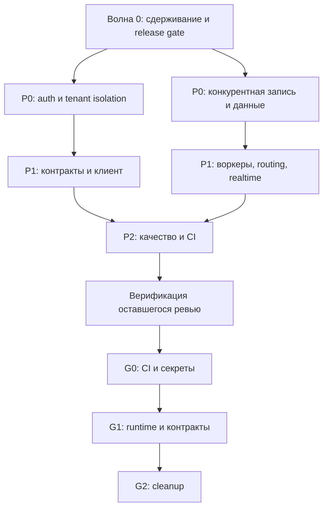

# План устранения подтверждённых замечаний код-ревью

**Источники:** [основной отчёт код-ревью](code-review-2026-07-16.md) и [второй раунд проверки пробелов](code-review-2026-07-16-gaps.md) от 17.07.2026.
**Статус (обновлён 17.07.2026):** локальный backlog основного отчёта, предварительного аудита и все 15 находок второго раунда закрыты реализацией и адресными проверками ниже. Полный browser-suite намеренно не повторялся из-за длительности; публикация CI в remote, staging/production rollout и branch protection остаются внешними release-gates.
**Охват актуальных отчётов:** 164 подтверждённые находки — 149 в основном отчёте и 15 во втором раунде. Текущий локальный остаток второго раунда: **0**; high GAP-01 закрыт в локальном git-индексе, но workflow ещё не опубликован в `origin/main`.

## Цель и границы

Цель плана — сначала устранить уязвимости, межтенантные нарушения и необратимую потерю данных, затем восстановить работоспособность критичных сценариев и закрыть надёжность, тестовые и эксплуатационные долги.

В план включаются только подтверждённые находки. Спорный пункт основного отчёта учитывается отдельно как hardening, а опровергнутые находки обоих раундов в работу не берутся. Для второго раунда статус определён повторной проверкой именно текущего worktree: наличие файла или теста не считается исправлением, если production-путь по-прежнему отсутствует.

## Результат реализации

- Реализованы исходные 42 декомпозированные задачи; последующий follow-up расширил покрытие до актуального основного отчёта: security/tenant isolation, конкурентная запись, workers/contracts, bounded realtime, UI/widget, durable identity/automation и тестовый контур.
- Добавлены миграции `202607160001_realtime_read_index`, `202607160002_settings_rules_persistence`, `202607160003_automation_workspace_audit` и `202607160004_quality_scoring_idempotency`; Prisma schema проходит validate/generate.
- CI workflow `.github/workflows/ci.yml` подготовлен и отслеживается в локальном `HEAD`: frontend/backend/widget build и тесты, tenant-isolation, migration rollback check, Prisma validate/generate и однопоточный Playwright на отдельной smoke-БД. В `origin/main` файла ещё нет, поэтому внешний CI пока не запускается.
- Локально прошли backend full suite — 1591/1591 тест в 170 suites, root unit — 265/265, web-widget — 16/16, а также frontend/backend/widget production build.
- Прошли Prisma validate/generate, tenant isolation — 23/23, audit immutability — 10/10, migration rollback contracts — 7/7, security audit — 0 moderate/high/critical уязвимостей, `docker compose config --quiet` и discovery 62 Playwright-сценариев в 5 spec-файлах. Исправленный report/settings runtime flow ранее прошёл на чистой smoke-БД.
- Финальный аудит дополнительно закрыл API-редакцию телефона по permission, условное освобождение просроченной quota reservation, per-connection backoff Telegram polling, retention worker для realtime events, полную карту владельцев Prisma-таблиц и согласованную scrypt-маркировку seed/bootstrap credentials.
- Ручная верификация остатка дополнительно закрыла гонки claim для Open Channel, webhook journal и просроченных quota reservations; подключила quota-expiration worker; добавила SSRF-защиту исходящих Open Channel URL; исправила локальное состояние диалогов, серверный logout, notification fan-out/UTF-8, снимок отчёта, сценарии automation, защиту UI-мутаций от повторных запусков и fail-closed release-инструменты.
- Последний полный повтор browser-suite был остановлен по запросу пользователя после примерно 50 из 62 сценариев из-за длительности. Он сохранил три падения: два теста ошибочно считали допустимое накопленное состояние общей smoke-БД ошибкой, третий использовал устаревший label кнопки и искал форму вне модального контейнера. Контракты исправлены; адресный прогон подтвердил все три сценария (два прошли вместе, сценарий клиентов после инфраструктурного таймаута холодной навигации прошёл отдельно с увеличенным только для запуска timeout). Полный набор повторно не запускался; окончательное подтверждение остаётся за чистым CI e2e run.
- Не выполнялись действия во внешних средах: production backup/restore point, staging rollout/monitoring и назначение CI checks обязательными в branch protection. Они остаются release-задачами владельца инфраструктуры.
- До появления gaps-документа отдельно проверялись ранее исключённые зоны: `presence`, `incidents`, `feature-flags`, `audit`, `runtime`, public assets, корневые HTML/manifest, `.playwright-runtime`, CI workflow, `.env.example`, эксплуатационная документация, миграции и web-widget периферия. Девять найденных тогда дефектов исправлены и закреплены адресными тестами; второй раунд выявил ещё 11 локальных пунктов, теперь также закрытых волной G.
- Перепроверка второго раунда подтвердила четыре существующих исправления и привела к реализации оставшихся 11: fail-closed master keys, CSP, удаление orphan fixtures/dead API, синхронизация Open Channel, безопасный audit period, parity Prisma index и воспроизводимый widget preview.
- Адресная проверка волны G: backend typecheck; Prisma validate/generate; 50/50 audit/incidents/presence contracts; 13/13 config tests; 22/22 widget tests и production build; CSP, Prisma-index, Playwright data-source и docs-smoke contracts; ручной browser smoke `/demo.html` с загрузкой bundle и открытием панели без console errors.

### Незакрытые критерии и владельцы

| Критерий | Статус на 17.07.2026 | Что требуется для закрытия |
|---|---|---|
| Полный Playwright на изолированной PostgreSQL smoke-БД | Полный прогон остановлен после примерно 50 из 62 сценариев из-за длительности; три сохранённых падения исправлены и адресно перепроверены, но полного зелёного результата нет | Выполнить полный однопоточный `npx playwright test` в CI на чистой smoke-БД и сохранить результат как обязательный PR check |
| Production baseline и секреты | Не выполнялось: нет предоставленного production-доступа и runbook authority | Снять и проверить restore point, сверить миграции/образы, проверить demo credentials и при необходимости ротировать секреты |
| Staging rollout и наблюдение | Не выполнялось: staging не предоставлен | Развернуть миграции и код, выполнить smoke/load/concurrency сценарии и проверить метрики из раздела ниже |
| Обязательные PR checks | Workflow отслеживается локальным `HEAD`, но отсутствует в `origin/main`; branch protection не менялся | Запушить ветку, получить зелёные checks и назначить их required в настройках репозитория |
| Остаток основного отчёта | Спорный случай закрыт fail-closed hardening; частично проверенный backup race подтверждён и исправлен; локальный follow-up основного отчёта закрыт | Сохранять regression-контракты; новые находки вести отдельным циклом |
| Второй раунд непокрытых зон | Все 15 подтверждённых находок закрыты локально | Сохранять адресные контракты; отдельно закрыть публикацию/required checks по внешней задаче `G0-01` |

### Follow-up по ручной верификации остатка

Основной автоматически сформированный документ остаётся источником перечня находок. Ниже зафиксирован локальный результат повторной проверки на текущем коде.

| Группа | Подтверждено и исправлено | Проверка |
|---|---|---|
| Конкурентность и workers, 5 находок | Атомарный claim Open Channel и webhook journal; защита event-pump от перекрытия; атомарный claim expired quota; реальный `quota-expiration.main.ts` и compose-сервис | Конкурентные Prisma-контракты, worker once-контракт, backend build и compose config |
| Security и lifecycle, 4 находки | SSRF-защита URL и DNS непосредственно перед отправкой; корректное восстановление URL/MCP knowledge source; общий MCP rate limiter | Negative/private-IP/DNS тесты, source lifecycle и MCP contracts |
| UI, automation и сессии, 16 находок | Сброс состояния close outcome, bot handoff и client history; серверный logout tenant/service-admin; fail-closed guards; корректные source labels/version и dirty/draft semantics; доступность URL-source dialog в пустом workspace; warning-tone для partial data; защита SDK/admin/employee мутаций от повторного запуска | Root unit contracts и frontend production build |
| Notifications и reports, 4 находки | Читаемый UTF-8 critical alert, подключённый realtime fan-out, `invalid`-конверт для неверных фильтров, сохранение export `snapshotAt` | Notification/report contracts и backend build |
| Release/runtime, 9 находок | Запрет reuse чужого Vite-сервера, fail-closed security audit, compose `--wait`, полный список workers в health-check, отдельная SSE-конфигурация nginx без buffering, изолированное webhook-уведомление watchdog, bounded Telegram `getMe`, полный scrub provider/secret env и удаление неработающего seed-флага notification worker | Release/Playwright/Telegram contracts, security audit, backend build и compose config |
| Контракты и cleanup, 20 находок | Удалены эквивалентный policy branch и неиспользуемые token/report/auth/access/test helpers; сохранён path-префикс API base URL; добавлены fail-fast route-id guards и `x-request-id` для health; исправлены navigation/dialog/Rules contracts, ошибки вторичных вкладок знаний, conversation-scoped состояние и обновление статуса операторов widget, WebSocket unmasking, idempotent alert acknowledgement, раздельный billing summary по валютам и durable claim/result replay для `scoreDraftResponse` без повторного LLM-вызова | Root unit 265/265, web-widget 16/16, backend full suite 1591/1591, Prisma validate/generate и production builds |
| High/medium contracts, 3 находки | `scoreThreshold` включён в retrieval cache key; выдаваемые webhook URL приведены к реальным ingress-маршрутам Telegram/VK/MAX; обновление одного поля опубликованного bot-сценария отправляет узкий draft patch и не затирает накопленный overlay | Retrieval 7/7, integration 40/40 и automation 13/13 contracts |
| Frontend state и network, 6 находок | Канал архивного диалога берётся из самого диалога; transcript корректно перепривязывается при смене conversation; удалён мёртвый attachment callback; deep-link подключения потребляется однократно; API-запросы получили cancel/timeout; загрузки AI connections защищены от смены tenant во время запроса | Адресные dialog/API/UI contracts и frontend production build |
| Backend runtime contracts, 4 находки | В ingestion не сохраняются сырые transport errors; `LOG_LEVEL` реально фильтрует structured logs; fallback-роли согласованы с seed; Telegram outbound ограничен timeout | Foundation, ingestion, identity и Telegram contracts 55/55; backend typecheck |
| Knowledge ingestion queue, 3 находки | Добавлены восстановление просроченного lease, атомарный claim с лимитом попыток, идемпотентное восстановление после `P2002` и удаление связанных jobs вместе с source | Repository contracts 6/6 и backend typecheck |
| Proactive delivery, 2 находки | Descriptor/outbox плана теперь сохраняются после создания exposure; обработчик conversion подавляет только ожидаемый unique conflict, а прочие ошибки БД пробрасывает | Automation/proactive contracts 10/10 |
| Outbox worker, 2 находки | Пустой результат scanner переводит claim в retry/dead-letter путь; сетевые ошибки HTTP adapter сохраняют ограниченную и отредактированную причину | Два адресных worker-contract теста и backend typecheck |
| Security и error envelopes, 3 находки | `accessToken` редактируется в URL и тексте исключений; неизвестные HTTP-исключения получают безопасный 500-envelope с trace ID; `tenant/select` требует bearer-сессию и не принимает клиентский email, а UI больше не делает публичный membership lookup перед логином | Redaction, exception-filter, tenant-auth и UI contracts; backend typecheck |
| Runtime observability и test discovery, 2 находки | Reconciliation worker записывает `bot_delivery_failures_total` с bounded labels при сбое message/handoff side effect; два colocated provider/SSRF suite подключены к стандартному backend test discovery. Первый реальный запуск дополнительно устранил сериализацию отсутствующего `cachedTokens` как `undefined` | Bot reconciliation metric contract, 12 provider/SSRF tests и backend typecheck |
| Durable worker claims, 2 находки | Browser-push delivery атомарно переводит `queued/stale processing` в `processing` и завершает только свой claim; report export использует CAS по `id/status/updatedAt`, уникальный claim token и lease recovery для stale `running` | Notification worker/repository и report export worker/repository concurrency contracts; backend typecheck |
| AI usage concurrency, 2 находки | RPM reservation выполняется в Serializable-транзакции с retry конфликтов; token usage увеличивается атомарным Prisma `increment`, а локальный concurrent-run slot резервируется до первого `await` | AI usage repository contracts, включая concurrent reserve и 25 параллельных token increments; backend typecheck |
| ClamAV scanner error policy, 1 находка | Ошибки входного контракта получают точные 400/403/410/413; scanner/download failures остаются 503. HTTP adapter сразу переводит постоянные 4xx в dead letter, сохраняя retry для 5xx | Error-classification contracts, поведенческий worker-contract и backend typecheck |
| Sandbox usage concurrency, 1 находка | Месячный счётчик токенов sandbox увеличивается атомарным Prisma `increment` без read-modify-write | Concurrent contract на 25 параллельных инкрементов и backend typecheck |
| Closed conversation lifecycle, 1 находка | Из `closed` разрешён только явный переход в `reopened`; прямой обход reopen через `active/assigned/...` отклоняется без очистки `resolutionOutcome` | Conversation lifecycle contract и backend typecheck |
| Client profile merge integrity, 1 находка | Merge/unmerge проверяют существование всех profile/source-profile ID в текущем tenant до записи immutable-события | Workspace contract и backend typecheck |
| Settings connection summary, 1 находка | Сводка подключений загружается независимо при входе на другую вкладку, не показывает ложный `0 из 0`, а уже открытая вкладка подключений остаётся единственным источником запроса | UI source contract и frontend production build |
| Widget default environment, 1 находка | Виджет без явного `environment` использует тот же production default, что и backend | Widget contract и production bundle build |
| Dead-code cleanup II, 3 находки | Удалены orphan-хук conversation mutations, вытесненный локальный конструктор outbound conversation и три неиспользуемых async-wrapper-а чтения результатов load test | Cleanup source contracts, frontend production build и backend typecheck |
| Dead-code cleanup III, 4 находки | Удалены orphan Telegram setup panel, каталог `scripts/seeds` с артефактами и пятью одноразовыми кодмодами, неиспользуемый identity seed shim и связанный только с ним service-admin demo catalog | Поиск живых импортов, cleanup source contracts, frontend production build и backend typecheck |
| Widget identity and proactive session, 2 находки | `clearHistory()` перевыпускает subject/external/session IDs и очищает conversation-scoped state; accepted invitation получает от backend scoped visitor token и сохраняет его для polling | Backend invitation/token contract, widget 19/19 и widget production build |
| Widget polling reliability, 1 находка | Message/invitation/presence polling использует неперекрывающиеся timeout-циклы, bounded exponential backoff и однократную диагностику по типу/коду сбоя | Widget 20/20 и production bundle build |
| Onboarding provision contract, 2 находки | UI требует реальный SDK-домен вместо `${slug}.example.test`; tariff ID, отрасль, billing cycle, роль, 2FA и стартовые лимиты доходят до backend и сохраняются в tenant metadata | Root provision 4/4, backend provision contract и backend/frontend builds |
| Report digest claim/recovery, 1 находка | Клейм due/stale-running дескрипторов перенесён в репозиторий: Prisma использует compare-and-set по status/updatedAt, in-memory — атомарное обновление store; исключение возвращает дескриптор в due и не прерывает обработку остальных | Digest contracts 10/10, Prisma concurrency/lease 1/1 и backend typecheck |
| Provider attachment transfer timeouts, 1 находка | Загрузка signed-файла и все VK/MAX upload/save HTTP-шаги ограничены AbortController-таймаутом; Telegram отдельно ограничивает download и multipart upload | VK/MAX connector contracts 6/6, Telegram attachment contracts 2/2 и backend typecheck |
| Post-provider delivery accounting, 1 находка | Ошибки записи provider binding/deliveryState после подтверждённой отправки логируются как reconciliation, но не переводят outbox-событие в failed и не запускают повторную отправку; уже delivered-дескриптор пропускает вызов провайдера | Provider connector 6/6, адресные outbox success/failure/reconciliation contracts 3/3 и backend typecheck |
| Bot runtime retry execution, 1 находка | `retry_scheduled` инстансы выбираются и CAS-клеймятся с lease, исходный inbound event восстанавливается из durable step и повторно исполняется в подключённом reconciliation worker; сервис присутствует в compose и health-check | Адресный bot runtime retry contract 1/1 и проверка runtime wiring |
| Template editor variables/preview, 1 находка | Кнопки переменных вставляют токен в текущую позицию/выделение textarea и сохраняют фокус; «Предпросмотр» открывает доступный modal с подстановкой примерных значений вместо toast-заглушки | Template model 2/2 и frontend production build |
| Dialog copy/information controls, 1 находка | «Копировать» формирует tenant-safe сводку с маскированным для ограниченной роли телефоном и использует clipboard service; «Информация» раскрывает связанный aria-панелью контекст текущего диалога | Clipboard + control-wiring contracts 5/5 и frontend production build |
| Conversation inbox pagination, 1 находка | Footer-кнопки загружают предыдущую/следующую backend-страницу вместо no-op; состояние нормализует total/page/pageCount, блокирует границы и загрузку, а sequence guard отбрасывает устаревший ответ | Pagination model/wiring 2/2 и frontend production build |
| Auth demo organization cleanup, 1 находка | Удалены живые fallback-memberships `North Retail`/`City Care`/`Internal Support`; organization selector и `onAuthSuccess` теперь получают tenant только из ответа login API | Auth source contract 1/1 и frontend production build |
| Knowledge ingestion dead-code cleanup, 1 находка | Удалён неиспользуемый синхронный `ingestScannedAttachment` и его дублирующий тест; единственным production-путём индексирования attachment осталась durable очередь с object-storage worker | Cleanup contract 1/1, worker ingestion contract 1/1 и backend typecheck |
| Routing capacity override, 1 находка | `overrideLimit` применяется только при исчерпанной channel capacity и серверном `overrideAllowed`; клиентский флаг без разрешения по-прежнему отклоняется с диагностикой | Адресные routing contracts 2/2 |
| Dialog detail retry, 1 находка | Диалог помечается загруженным только после успешного detail-ответа; transient failure получает один bounded retry, финальная ошибка попадает в существующий inbox error state, а in-flight guard очищается через `finally` | Inbox retry contract 1/1 и frontend production build |
| Playwright widget server, 1 находка | Playwright автоматически собирает и поднимает widget preview на `:5174`; pilot flow больше не проверяет доступность вручную и не превращает отсутствие сервера в `skip` | Runtime config contracts 2/2 и widget production build |
| Required smoke fixtures, 1 находка | Settings smoke явно требует единственные `Production SDK key` и `VK inbound`; условные ветки с тривиальными fallback-ассерциями удалены | Fail-closed smoke source contract 1/1 |
| Backend contracts package cleanup, 1 находка | Удалён никем не импортируемый `@support-communication/contracts` с разошедшимся каталогом сервисов; очищены project reference, path alias и workspace lock entry | Cleanup contract 1/1 и backend typecheck |
| Billing provider dead-code cleanup, 1 находка | Удалены не подключённые к runtime `billing-provider.port.ts` и `billing-provider.sandbox.ts`, включая фабрику, игнорировавшую `mode`; действующий outbox/provider-sync контур не затронут | Cleanup contract 1/1 и backend typecheck |
| Prisma index parity, 1 находка | В `schema.prisma` объявлены три уже созданных миграциями обычных индекса: resolution outcome диалогов, channel binding public API keys и audit binding impersonation; удалённые, default-named и partial индексы не дублировались | Schema parity contract 1/1, Prisma validate/generate |
| Private report template ownership, 1 находка | Report controller формирует `requesterUserId` как из tenant-operator, так и из service-admin контекста; private template выдаётся только своему owner внутри tenant | Адресные report ownership/visibility contracts 2/2 |
| Bot scenario update allowlist, 1 находка | Из `updateBotScenario` удалён mass assignment `...request`; изменяемые поля нормализуются явно, а `tenantId`, `id`, holds, retention, active version, timestamps, draft и lifecycle-поля остаются server-owned | Mass-assignment regression 1/1 и backend typecheck |
| Automation Prisma state/audit, 2 находки | Prisma `readStateAsync` гидратирует runtime instances/steps, а workspace audit фасад делегирует запись в Prisma и не оставляет её в process-local store | Совмещённый Prisma automation contract 1/1 |
| Operations dead-letter runtime backends, 1 находка | В staging/production registry подключены реальные адаптеры report export и webhook delivery; local сохраняет deterministic stores, а не реализованный `realtime-fanout` явно replay-disabled | Runtime backend contracts 3/3 и backend typecheck |
| Identity auth/provision completion, 4 находки | Membership lookup выполняет один индексируемый поиск по email; employee password reset создаёт recovery token и доставку; provision компенсирует identity/billing/integration; публичная tenant session не выдаёт недействующий refresh token | Адресные identity/provision contracts 6/6 |
| Workspace upload quota runtime, 1 находка | `WorkspaceModule` подключает file-upload checker к billing storage quota и переводит GiB-контракт billing в байты file API; ошибки billing закрывают загрузку fail-closed | Workspace quota contracts 2/2 и backend typecheck |
| Conversation lifecycle SQL pagination, 1 находка | `cursor`, `skip` и bounded `take` передаются непосредственно в Prisma вместо загрузки всей lifecycle-истории с пагинацией в памяти | Prisma conversation pagination contract 1/1 и backend typecheck |
| Telegram outbound connection ownership, 1 находка | Dispatcher получает `channelConnectionId` диалога и выбирает соответствующий активный bot token; legacy-диалог без привязки принимается только при единственном активном подключении | Telegram outbound contracts 2/2 и backend typecheck |
| S3 finalize metadata, 1 находка | S3 signer выполняет подписанный `HEAD` с timeout и возвращает фактические `content-length`/SHA-256 metadata для проверки finalizeUpload | S3 signer contracts 2/2 и backend typecheck |
| Routing analytics batch persistence, 1 находка | Append-only история routing analytics сохраняется одним `createMany(..., skipDuplicates)` вместо линейной серии upsert-запросов при каждом сохранении state | Prisma routing batch contract 1/1 и backend typecheck |
| Durable topic directory, 1 находка | Module-level Map заменён tenant-scoped Prisma repository и моделью `workspace_topics`; in-memory реализация осталась только тестовым адаптером | Topic contracts 4/4, Prisma validate/generate и backend typecheck |
| Atomic quota reservation, 1 находка | Проверка idempotency, сумма active reservations, limit decision и create объединены транзакционной advisory-lock по tenant/resource; in-memory adapter сохраняет ту же атомарную семантику | Concurrent billing contracts 2/2 и backend typecheck |
| Widget strict CSP, 1 находка | Inline styles получают явный `styleNonce`/nonce embed-script, shell строится DOM API без `innerHTML`, пользовательские цвета проходят CSS-валидацию | Widget CSP contract 1/1 и production bundle build |
| OIDC domain/provider contract, 1 находка | UI передаёт домен и различимые поддерживаемые OIDC provider IDs; backend сверяет домен с tenant провайдера; неподдержанный SAML-start убран из формы | Backend OIDC 1/1, UI source 1/1 и frontend production build |

### Предварительный аудит ранее непокрытых зон

Эта проверка выполнялась до публикации `code-review-2026-07-16-gaps.md`. Она закрыла девять самостоятельных дефектов, но не является доказательством полного покрытия второго раунда.

| Группа | Подтверждено и исправлено | Проверка |
|---|---|---|
| Presence concurrency, 1 находка | Смена статуса сериализуется PostgreSQL advisory-lock по tenant/operator; partial unique index гарантирует один открытый интервал и миграция чинит исторические дубли | Presence contracts 16/16, Prisma validate и backend typecheck |
| Public push navigation, 1 находка | Service worker принимает только same-origin URL и заменяет внешние/невалидные ссылки безопасным `/#/app` | Service-worker security contracts 2/2 |
| Incidents transactionality, 1 находка | Incident, immutable audit, platform outbox и idempotency result сохраняются одной транзакцией; per-incident lock предотвращает потерю параллельных timeline updates | Platform contracts 28/28, включая concurrent update и rollback; Prisma platform 5/5 |
| Feature-flag mutation contract, 1 находка | Flag, rollout rule, audit и outbox сохраняются одной транзакцией; replay старого idempotency key не откатывает новое состояние; rollout и tenant IDs валидируются до записи | Platform contracts 28/28 и audit/outbox contracts 22/22 |
| Audit degradation, 1 находка | Сбой одного источника больше не маскируется под полный пустой журнал: backend возвращает `sourceHealth`/`unavailableSources`, UI показывает partial-warning | Workspace audit contracts 4/4 и frontend production build |
| Audit CSV export, 1 находка | Ячейки, начинающиеся с формульных префиксов, нейтрализуются перед CSV-экспортом; разделители и переводы строк экранируются | Audit export security contracts 2/2 |
| Runtime env/docs contract, 2 находки | `.env.example` документирует все ключи core config и все операторские compose overrides; из runbook удалены устаревшие `*_REPOSITORY=prisma` после Prisma-only миграции | Runtime env contracts 2/2 |
| Widget demo environment, 1 находка | Оба stage-key примера demo явно задают `environment: "stage"`, не полагаясь на production default библиотеки | Widget unit contracts и production bundle build |

Дополнительно подтверждено без исправлений: `AppShell`, `SectionRouter` и контроллеры проверенных backend-модулей не обходят серверные guards; актуальные npm-команды в эксплуатационной документации существуют; новые partial indexes оформлены миграциями. При повторной проверке выводы о `.playwright-runtime` и полной parity Prisma schema пересмотрены: JSON-файлы валидны синтаксически, но осиротели, а индекс `mcp_connectors` имеет различающиеся имена в schema и миграции.

### Верификация второго раунда

| ID | Sev | Находка второго раунда | Статус по текущему коду | Доказательство |
|---|---|---|---|---|
| GAP-01 | high | `.github/workflows/ci.yml` не отслеживается git | **Закрыто** | `git ls-files` возвращает путь, файл присутствует в локальном `HEAD`; публикация в `origin/main` и required checks остаются отдельным внешним gate. |
| GAP-02 | medium | CSV/formula injection в audit export | **Закрыто** | `auditExport.js` нейтрализует формульные префиксы и экранирует CSV; адресные тесты 2/2. |
| GAP-03 | medium | Устаревшие `NOTIFICATION_REPOSITORY`/`INTEGRATION_REPOSITORY` в `runtime-configuration.md` | **Закрыто** | Устаревшие ключи удалены из указанного runbook; runtime env-контракты 2/2. |
| GAP-04 | medium | Осиротевшие `.playwright-runtime/api-gateway/*.json` | **Закрыто** | 18 JSON-файлов удалены; контракт закрепляет Prisma reset/identity/catalog seed как единственный e2e data source и fail-closed проверяет именованные smoke-записи (3/3). |
| GAP-05 | low | Документирован несуществующий `unauthorized_client` | **Закрыто** | Несуществующий код удалён из публичного документа; `public-api:docs:verify` проверяет разрешённые и запрещённые значения. |
| GAP-06 | low | `client_updated` заявлен, но не эмитится | **Закрыто** | Событие удалено из документации и runtime allowlist подписок; docs-smoke не допускает повторного появления. |
| GAP-07 | low | Поле `department` заявлено как общее поле event payload | **Закрыто** | Поле удалено из общего payload-контракта; docs-smoke закрепляет фактическую схему. |
| GAP-08 | low | Неизвестный/пустой audit period отключает фильтр | **Закрыто** | `undefined`, пустое и неизвестное значение нормализуются в `30d`; проверены также все четыре поддерживаемых периода (6/6 audit contracts). |
| GAP-09 | low | Мёртвый `overlayById` в incidents | **Закрыто** | Orphan helper удалён; incident transaction/idempotency contracts входят в зелёный адресный набор 50/50. |
| GAP-10 | low | Неиспользуемая presence bootstrap option `seed` | **Закрыто** | Игнорируемая option и неиспользуемый type import удалены; presence contracts и backend typecheck зелёные. |
| GAP-11 | low | Произвольный URL в browser push click | **Закрыто** | Service worker нормализует URL до same-origin/fallback; адресные тесты 2/2. |
| GAP-12 | low | Нет CSP для основного и service-admin HTML | **Закрыто** | Nginx отдаёт server-level enforce-CSP `always` для обеих entrypoints; scripts ограничены `'self'`, запрещены object/base/framing, контракт 3/3. Временное `'unsafe-inline'` изолировано только в `style-src` из-за React style attributes. |
| GAP-13 | low | Известный AES master key используется как compose fallback | **Закрыто** | Публичные compose fallback удалены; общий guard требует canonical base64 32-byte keys и отвергает known key вне local; API и оба worker entrypoint подключены, release-gate генерирует ephemeral keys (13/13 config tests, typecheck). |
| GAP-14 | low | Имя индекса `mcp_connectors` различается в schema и миграции | **Закрыто** | Prisma `@@index` получил `map: "mcp_connectors_tenant_status_idx"`; parity contract, Prisma validate и generate зелёные. |
| GAP-15 | low | Widget demo не раздаётся через документированный `vite preview` | **Закрыто** | Demo перенесена в `public`, build копирует её в `dist`, bundle подключается как `/widget.js`; 22/22 unit, build и короткий browser smoke с открытием панели зелёные. |

Итог второго раунда: **15 из 15 закрыты локально, открытых локальных gaps нет**. Расхождение «19 файлов» из gaps-документа уточнено: было отслеживаемо 18 JSON fixtures, все они удалены. Для GAP-01 gaps-документ отражает более раннее состояние: файл tracked локально, но ещё не дошёл до remote; публикация и required checks остаются внешним gate.

## Дополнительная волна G — закрытие gaps второго раунда

Приоритет выполнения учитывал не только severity отчёта, но и влияние на возможность безопасно выпустить остальные исправления. Локальные задачи `G0-02`–`G2-02` выполнены 17.07.2026; `G0-01` остаётся внешней задачей публикации CI и настройки branch protection.

### G0 — release gate и секреты

| ID | Покрывает | Декомпозиция | Критерий готовности |
|---|---|---|---|
| G0-01 | GAP-01, внешний gate | Повторно проверить YAML и все вызываемые npm scripts уже отслеживаемого workflow; запушить ветку; выполнить первый run с отдельной PostgreSQL smoke-БД и однопоточным Playwright; включить checks как required. | GitHub Actions запускается на PR; build/typecheck/targeted security/Prisma/e2e jobs зелёные; merge блокируется при красном job. |
| G0-02 | GAP-13 | Удалить публичные fallback-значения `PROVIDER_CREDENTIAL_MASTER_KEY` и `AI_CONNECTIONS_MASTER_KEY` из production-like сервисов compose; добавить общий startup guard на отсутствие, неверную длину и известный demo-key; для local/test передавать отдельный явно локальный ключ через профиль/fixture; синхронизировать `.env.example` и release-gate scrub. | Production-like config не стартует без уникальных 32-byte keys и с известным ключом; local stack стартует только с явно заданным local secret; зашифрованные credentials читаются после controlled key/version setup. |

### G1 — runtime, контракты и поставка фронтенда

| ID | Покрывает | Декомпозиция | Критерий готовности |
|---|---|---|---|
| G1-01 | GAP-12 | Составить allowlist реально используемых origin/schemes; добавить CSP header `always` в nginx для основного SPA и service-admin; запретить `object-src`, `base-uri` и framing; убрать несовместимые inline script/style либо оформить nonce/hash; добавить проверку заголовка на обеих entrypoints. | Оба HTML отдаются с enforce-CSP; приложение и service-admin проходят smoke без CSP violations; инлайн-скрипт без nonce/hash блокируется. |
| G1-02 | GAP-04 | Удалить 18 осиротевших JSON fixtures и тест, который лишь закрепляет их существование. Проверить, что Playwright создаёт состояние только через Prisma bootstrap/API fixtures, и документировать bootstrap как единственный владелец/генератор e2e-данных. | В git нет неиспользуемого каталога; e2e bootstrap не читает скрытые JSON; required settings fixtures создаются явным кодом и fail-closed проверяются smoke-тестом. |
| G1-03 | GAP-05, GAP-06, GAP-07 | Зафиксировать runtime как источник истины для External Bot API: удалить неподдерживаемые `unauthorized_client`, `client_updated` и `department` из публичного контракта, а `client_updated` — также из allowlist подписок; обновить примеры payload и расширить `public-api:docs:verify`, сверяя документацию с enum/emitter-ами. | Документ перечисляет только реально возвращаемые коды, поддерживаемые события и фактические поля; contract-test падает при новом дрейфе. |
| G1-04 | GAP-08 | Нормализовать `undefined`, пустой и неизвестный `period` в безопасный default `30d`; одинаково применить контракт в controller/service/UI. Добавить тесты для отсутствующего значения, пустой строки, неизвестного значения и четырёх поддерживаемых периодов. | Невалидный period не открывает неограниченную историю и даёт тот же диапазон, что явный `30d`. |
| G1-05 | GAP-14 | Добавить `map: "mcp_connectors_tenant_status_idx"` к Prisma `@@index`; закрепить schema/migration parity контрактом без новой дублирующей миграции. | `prisma validate/generate` зелёные; diff миграций не предлагает drop/recreate или второй индекс. |
| G1-06 | GAP-15 | Перенести demo в `packages/web-widget/public/demo.html`, чтобы Vite копировал его в `dist`; заменить ссылку на фактически раздаваемый `/widget.js`; сохранить `/api` proxy; обновить source-тест и добавить HTTP/browser smoke для `/demo.html` и bundle. | После `npm run widget:preview:e2e` `/demo.html` и `/widget.js` отвечают 200, `SupportWidget.init` доступен, запросы идут через proxy. |

### G2 — cleanup подтверждённого мёртвого API

| ID | Покрывает | Декомпозиция | Критерий готовности |
|---|---|---|---|
| G2-01 | GAP-09 | Удалить неиспользуемый `overlayById` из `incident.service.ts`; убедиться, что merge state выполняется только в platform repository и не дублируется сервисом. | В incidents нет orphan helper; incident transaction/idempotency contracts остаются зелёными. |
| G2-02 | GAP-10 | Удалить `seed` из `OperatorPresenceBootstrapOptions` и связанных тестовых вызовов; тестовые начальные данные создавать непосредственно через in-memory repository adapter. Prisma runtime не должен принимать неработающую настройку. | Публичный bootstrap contract не обещает игнорируемый seed; presence contracts и typecheck зелёные. |

### Адресная проверка волны G

1. CI/repository: `git ls-files .github/workflows/ci.yml`, проверка YAML и первый PR run; затем required status в branch protection.
2. Security/config: compose config с уникальными ключами проходит, без ключей и с demo-key завершается fail-closed; nginx config тестируется и обе HTML-entrypoint проверяются на CSP header.
3. Backend: адресные audit/incidents/presence/Open Channel contracts, `npm run backend:typecheck`, Prisma validate/generate и schema-index parity test.
4. Frontend/widget: `node --test` для audit/push контрактов, widget unit suite/build и короткий browser smoke только demo entrypoint.
5. Test data: поиск ссылок на `.playwright-runtime` вне документации должен быть пустым; required e2e fixtures создаются bootstrap-кодом и проверяются fail-closed.
6. Полный Playwright не входит в локальную волну G из-за длительности; он остаётся отдельным чистым CI gate.

## Принципы выполнения

- Каждая задача меняется отдельным небольшим PR с регрессионным тестом на исходный сценарий.
- Изменения схемы БД выполняются отдельной миграцией с проверкой на пустой и заполненной базе.
- Для тенантных API обязательны тесты как минимум с двумя тенантами: допустимый доступ своего тенанта и запрет доступа к чужому.
- Для очередей, вебхуков, квот и сообщений обязательны интеграционные тесты на реальном Postgres и параллельные запросы.
- Перед включением исправления в production необходимо определить способ отката и метрики: ошибки авторизации, конфликты версий, дубли доставок, потерянные события, время ответа и размер очередей.

## Последовательность работ

| Волна | Приоритет | Результат | Зависит от |
|---|---|---|---|
| 0 | P0 | Сдерживание активных рисков и подготовка безопасного релиза | — |
| 1 | P0 | Тенантная изоляция, аутентификация и целостность данных | Волна 0 |
| 2 | P1 | Рабочие фоновые процессы, контракты и масштабируемость | Волна 1 для связанных диалогов и событий |
| 3 | P2 | Надёжность identity/automation, UX и тестовый контур | Волны 1–2 |
| 4 | Контроль | Верификация остатка ревью и закрытие покрытия | Волны 1–3 |
| G0–G2 | P0–P2 | Закрытие 11 локальных находок второго раунда и внешнего CI gate | Результаты предварительного аудита и gaps-верификация |

## Волна 0 — подготовка и сдерживание риска

| ID | Задача | Действия | Критерий готовности |
|---|---|---|---|
| R0.1 | Зафиксировать базовую точку | Снять резервную копию production-БД по действующему runbook, зафиксировать версии образов и текущие миграции. | Есть проверенная точка восстановления до миграций P0. |
| R0.2 | Ограничить опасные поверхности до выпуска фиксов | Закрыть внешний доступ к `clamav-scanner`; отключить WebSocket replay либо разрешить его только сервис-админам; не запускать release checklist, содержащий seed. | Уязвимые пути недоступны извне либо ограничены временной политикой доступа. |
| R0.3 | Ротация и аудит | Проверить, не попадали ли demo seed и известный пароль в целевые базы; при обнаружении — удалить/заблокировать такие учётные записи и сменить секреты. | Нет активных demo-учётных записей и известных паролей. |
| R0.4 | Минимальный release gate | До внедрения полного CI добавить локальную обязательную последовательность: build, typecheck, целевые тесты, миграции и security smoke. | Каждый P0 PR воспроизводимо проверяется одной командой/чеклистом. |

## Волна 1 — P0: безопасность и целостность данных

### 1. Тенантная изоляция и аутентификация

| ID | Находки | Реализация | Проверки |
|---|---|---|---|
| SEC-01 | `workspace/topics.controller.ts` | Повесить подходящий guard на весь контроллер; получать `tenantId` только из аутентифицированного контекста; передавать его в create/update/archive/restore и добавлять в условия поиска. Удалить fallback `tenant-northstar`. | Неаутентифицированные запросы получают 401/403; запросы тенанта A не читают и не меняют темы B. |
| SEC-02 | `conversation/realtime.websocket.ts` | Вынести общую проверку сервис-админской сессии для HTTP и WebSocket; отклонять сессии tenant-operator на сервис-админском канале. Для разрешённого tenant-канала передавать обязательный scope в `fetchRealtimeEvents`. | Tenant-operator не подключается к admin WS; события tenant A никогда не попадают в replay tenant B. |
| SEC-03 | `public-sdk-messages.route.ts`, `conversation.repository.ts` | Не использовать клиентский `conversationId` как глобальный первичный ключ. Создавать идентификатор на сервере либо использовать tenant-scoped внешний ключ; перед любым обновлением сверять владельца существующего диалога. | Сообщение SDK A с ID диалога B не меняет ни диалог, ни сообщения B. |
| SEC-04 | `workspace.service.ts` | Все операции с шаблонами выполнять по составному ключу `tenantId + id`; запретить upsert, который способен сменить владельца записи. | Оператор A не может создать/обновить/«присвоить» шаблон B. |
| SEC-05 | `report.controller.ts`, `ChatHeader.jsx` | Брать `requesterUserId` из обоих корректных auth-контекстов. Чувствительные поля редактировать в DTO/API по праву доступа; UI-маска должна быть fail-closed для любого формата телефона. | Приватные отчёты видны только владельцу; роль без `canViewSensitive` не получает телефон в API и интерфейсе. |
| SEC-06 | `identity/mfa-otp.ts` и config | Сделать runtime fail-closed: production/staging не стартуют без явного допустимого `NODE_ENV` и секретов; удалить тестовые default OTP и неявный bypass MFA. | Пустой `NODE_ENV` приводит к ошибке старта; в production нельзя войти с `123456` и нельзя обойти MFA. |

### 2. Доступ к служебным компонентам и выпуску

| ID | Находки | Реализация | Проверки |
|---|---|---|---|
| SEC-07 | `clamav-scanner.main.ts` | Убрать `ports` из публичного compose-профиля, ограничить сеть внутренним сегментом, добавить service-to-service аутентификацию. Принимать object key/attachment ID и загружать файл только из разрешённого storage, а не по произвольному URL. | С хоста сервис недоступен; запрос без сервисного секрета отклоняется; URL metadata/localhost не запрашиваются. |
| SEC-08 | `scripts/release-checklist.mjs` | Разделить инициализацию локальной БД и release checklist; запретить `prisma:seed` для staging/production кодом, а не договорённостью. | Release check не создаёт demo-пользователей; отдельная локальная инициализация работает только в явно local-окружении. |

### 3. Конкурентная запись и сохранность данных

| ID | Находки | Реализация | Проверки |
|---|---|---|---|
| DATA-01 | **critical:** `conversation.repository.ts:640` | Заменить полную перезапись сообщений на атомарные append/update-операции. Если агрегат всё же сохраняется целиком — добавить версию, условное обновление и повтор с чтением свежего состояния; сериализовать конкурентные записи одного диалога в транзакции. | Параллельные webhook, ответ оператора и AI не теряют ни одного сообщения; повтор события остаётся идемпотентным. |
| DATA-02 | `open-channel-delivery.service.ts`, `open-channel.repository.ts` | Клеймить запись атомарным переходом `pending → in_flight` с владельцем и TTL; исключить наложение тиков; добавить retry/lease recovery. | При нескольких `runOnce` каждая доставка уходит ровно один раз на один lease. |
| DATA-03 | `appeal-lifecycle.ts` | Заменить check-then-act на уникальный ключ follow-up обращения и атомарное create-or-get в БД. | Конкурентные вебхуки одного клиента создают ровно один follow-up диалог. |
| DATA-04 | `billing.repository.ts:1994` | Перенести проверку статуса reservation в условное обновление внутри транзакции; сделать commit/release взаимно исключающими и идемпотентными. | Конкурентные commit/release не оставляют дрейф usage и не переводят одну резервацию дважды. |
| DATA-05 | `identity/tenant.route.ts` | Определить контракт: URL `tenantId` — целевой тенант, сессионный tenant — только граница прав. Исправить приоритет значений и аудит/outbox. | PATCH выбранного tenant B не меняет tenant A, даже если тот хранится в сессии. |

## Волна 2 — P1: работоспособность, контракты и масштабирование

### 1. Маршрутизация, доставка и автоматизация

| ID | Находки | Реализация | Проверки |
|---|---|---|---|
| OPS-01 | `routing.repository.ts:1478` | Убрать вечный process-local cache версии либо после конфликта читать свежий снимок и повторять ограниченное число раз. Состояние процесса и БД синхронизировать транзакционно. | После работы SLA/rescue worker ручная операция gateway завершается без рестарта. |
| OPS-02 | `routing.service.ts:105`, `routing.service.ts:259` | Убрать общие изменяемые массивы singleton-сервиса: состояние операции должно быть локальным либо загружаться/сохраняться транзакционно. Реализовать документированный `overrideLimit`. | Параллельные операции не затирают друг друга; разрешённый override действительно проходит. |
| OPS-03 | `telegram-polling.worker.ts` | Обернуть обработку каждого подключения в независимый try/catch, записывать ошибку и продолжать следующий tenant; добавить backoff. | Сбой API одного Telegram-подключения не останавливает приём сообщений остальных. |
| OPS-04 | `open-channel-event-pump.ts`, `external-bot.route.ts` | Продвигать курсор только после успешной обработки, ретраить ошибки, защищать тик от наложения. Связывать `CHAT_CLOSED` с фактическим подключением диалога. | Ошибочное событие не пропадает, повтор не даёт лишних доставок, закрытие приходит нужному боту. |
| OPS-05 | `bot-runtime.service.ts:556`, `bot-runtime.service.ts:117` | Вычислять `isNewConversation` в доменном ingress/сервисе и прокидывать во все каналы. Подключить обработчик `retry_scheduled` к воркеру с наблюдаемым retry policy. | Новый диалог запускает опубликованный сценарий; временная ошибка повторяется и видна в метриках. |

### 2. Контракты интеграций и отчётов

| ID | Находки | Реализация | Проверки |
|---|---|---|---|
| CNT-01 | `integration.service.ts:1533` | Выбрать единый публичный webhook contract: либо генерировать существующие URL, либо реализовать отсутствующие маршруты. Обновить OpenAPI и документацию. | URL из API принимает реальный webhook соответствующего провайдера. |
| CNT-02 | `billing.repository.ts:4333` | Добавить `users` и `workspaces` в единую таблицу/маппинг ресурсов `applyUsageDelta`; проверить reservation и billing worker. | Commit резервации уменьшает квоту для каждого поддерживаемого ресурса. |
| CNT-03 | `report-digest.worker.ts` | Согласовать digest и export contract: передавать поддерживаемый preset либо добавить экспорт точного диапазона дат. | Scheduled digest создаёт и завершает export-задачу. |
| CNT-04 | `knowledge-retrieval.service.ts` | Канонически включить `scoreThreshold` и прочие влияющие параметры в ключ кэша. | Два порога для одного запроса не используют результат друг друга. |
| CNT-05 | `auth.service.ts:1210` | Реализовать refresh endpoint, rotation/revocation и клиентский путь обновления токена либо убрать недействующий refresh-token из контракта. | Сессия корректно обновляется до expiry refresh token или API явно не выдаёт refresh token. |

### 3. Диалоги, realtime и производительность

| ID | Находки | Реализация | Проверки |
|---|---|---|---|
| PERF-01 | `conversation.repository.ts:710` | Сделать `tenantId`, pagination и ограниченный include сообщений обязательными для `listConversations`; аудитировать все горячие вызовы. | SQL не читает чужие tenant-данные и не загружает все сообщения разом. |
| PERF-02 | `conversation.repository.ts:851`, `conversation.service.ts:244` | Ввести cursor/take в realtime events, индекс под порядок чтения и политику ретенции. Ограничить in-memory буфер `liveRealtimeEvents`. | Размер чтения и памяти остаётся ограниченным на длинной истории. |

### 4. Клиент и web-widget

| ID | Находки | Реализация | Проверки |
|---|---|---|---|
| UI-01 | `ChatPane.jsx` | Отменять устаревший AI-assist запрос через `AbortController` либо sequence ID; перед отображением проверять conversation/channel. | Ответ старого диалога не появляется в текущем. |
| UI-02 | `SettingsScreen.jsx` | Применять `requestedTab` только при первичной навигации/deep link и очищать этот источник после выбора пользователя. | После перехода из уведомления вкладки переключаются вручную. |
| UI-03 | `useWorkspaceRoute.js` | Ввести состояние гидратации сессии и не выполнять redirect, пока оно не завершено. | Возврат в `#/app` не разлогинивает действующую сессию. |
| UI-04 | `packages/web-widget/src/index.js` | Реализовать обновление visitor token до истечения TTL и обработку ошибки refresh. В `buildUrl` передавать base/поддерживать относительный `apiBase`. | Опрос работает дольше 15 минут; demo.html с относительным base не падает. |
| UI-05 | `AutomationScreen.jsx` | При изменении knowledge sources менять только соответствующую часть draft overlay, не пересоздавая черновик из опубликованной версии. | Несвязанные черновые изменения сохраняются. |

## Волна 3 — P2: надёжность и качество

### 1. Хранилище и automation

| ID | Находки | Реализация | Проверки |
|---|---|---|---|
| REL-01 | `settings-rules.service.ts` | Перенести правила и аудит из in-memory Map в Prisma с tenant scoping и миграцией. | После рестарта/на втором инстансе изменения и аудит сохраняются. |
| REL-02 | `automation.repository.ts:2038` | Добавить `botRuntimeInstances` и `botRuntimeSteps` в Prisma `readStateAsync`. | Операционные сводки непусты при наличии runtime-данных. |
| REL-03 | `automation.repository.ts:1308` | Делегировать `saveWorkspaceAuditEvent` в Prisma-адаптер. | Аудит сохраняется после рестарта gateway. |

### 2. Identity и provision

| ID | Находки | Реализация | Проверки |
|---|---|---|---|
| IDN-01 | `identity-auth-flow.repository.ts` | Запрашивать memberships одним индексируемым запросом по email вместо обхода tenant-ов и пользователей. | Логин выполняет ограниченное число запросов независимо от числа тенантов. |
| IDN-02 | `auth.service.ts:1350` | Проверять membership и адресата приглашения до изменения `consumedAt`; выполнять consume условным update в транзакции. | Ошибочный запрос не сжигает invite; валидный токен потребляется один раз. |
| IDN-03 | `auth.service.ts:1007` | Заменить неупорядоченный `findFirst` на tenant-aware выбор memberships; проверять active-статус выбранного tenant-а. | Активное membership позволяет логин независимо от порядка строк. |
| IDN-04 | `settings-employee.service.ts:242` | Ввести DTO/валидацию статуса и роли; проверку последнего администратора применять во всех путях обновления. | Нельзя деактивировать или понизить последнего администратора и нельзя сохранить неизвестный статус. |
| IDN-05 | `settings-employee.service.ts:270` | Использовать существующие recovery token и delivery-сервисы; хранить состояние сброса структурированно, не в `supportNotes`. | Админский reset создаёт действующий токен и отправляет/ставит в очередь сообщение. |
| IDN-06 | `tenant-provision.service.ts:144` | Обернуть provision в одну транзакцию, если возможно; иначе реализовать проверяемую компенсацию всех созданных сущностей. | Ошибка на любом шаге не оставляет tenant, slug или admin email заблокированными. |

### 3. Тестовый контур

| ID | Находки | Реализация | Проверки |
|---|---|---|---|
| TST-01 | `playwright.config.js` | Явно задать `testMatch` для `*.spec.*` и исключить node:test наборы из Playwright. | Голый `npx playwright test` не запускает backend/node:test и не меняет тестовую БД вне e2e. |
| TST-02 | `tests/settings-runtime.spec.js` | Либо добавить необходимые export jobs в изолированный seed, либо создавать их в тесте; согласовать ожидаемый статус retry с контрактом (`queued`/`running`). | Тест стабильно зелёный на чистой БД. |
| TST-03 | Отсутствие CI | Добавить CI: typecheck, unit/integration, целевые tenant-isolation и migration проверки, Playwright e2e в изолированной среде. | PR не может быть смёржен при падении обязательных проверок. |

## Карта зависимостей

`SEC-03` и `DATA-01` должны проектироваться совместно: оба меняют модель сохранения диалога. `DATA-02` и `OPS-04` должны иметь одну модель состояния и lease для доставок. `OPS-01` и `OPS-02` должны выпускаться одной серией изменений, так как оба используют состояние routing.

## Обязательные проверки перед каждым выпуском

1. `npm run build`, `npm run backend:typecheck` и целевые unit/integration тесты изменённых модулей.
2. Для изменений БД: `backend` Prisma validate/generate, прогон миграции и тест rollback/restore на тестовой базе.
3. Для P0: тесты на два tenant-а и параллельные запросы; security smoke без обхода auth.
4. Для UI и widget: Playwright regression на исходный пользовательский сценарий.
5. Мониторинг после выпуска: 401/403, ошибки WebSocket, `routing_state_snapshot_conflict`, количество повторных доставок, lag очередей, ошибки export и рост realtime-таблицы.

## Контроль завершения

- [ ] Все P0-задачи закрыты regression-тестами и прошли проверку на staging.
- [ ] Все P1-задачи прошли нагрузочные/конкурентные сценарии там, где применимо.
- [x] P2 и cleanup второго раунда закрыты: удалены осиротевшие fixtures/dead API, синхронизированы документация и Prisma index name, widget demo воспроизводимо раздаётся preview-сервером.
- [ ] CI включён как обязательный статус для PR.
- [x] Завершён локальный follow-up основного отчёта: спорный случай закрыт hardening-исправлением, частично проверенный race подтверждён и исправлен, адресные regression-контракты сохранены.
- [x] Завершён предварительный аудит ранее непокрытых зон; девять найденных им дополнительных дефектов исправлены адресными контрактами.
- [x] Закрыт второй раунд gaps: все 15 находок закрыты локально; публикация CI и required checks вынесены во внешнюю задачу `G0-01`.
