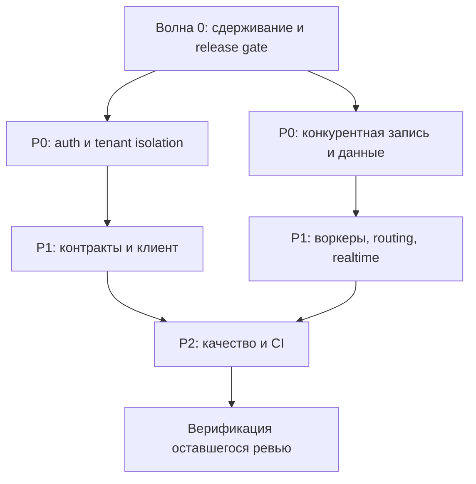

# План устранения подтверждённых замечаний код-ревью

**Источник:** [промежуточные итоги код-ревью](code-review-2026-07-16.md) от 16.07.2026.  
**Статус (обновлён 17.07.2026):** подтверждённый охват и доступные локальные regression/release-проверки реализованы; дополнительно вручную подтверждена и исправлена 61 из 139 находок исходного бэклога. Полный browser-suite, staging/production rollout и branch protection ещё не закрыты.  
**Охват:** 48 подтверждённых находок: 1 critical, 25 high, 22 medium.

## Цель и границы

Цель плана — сначала устранить уязвимости, межтенантные нарушения и необратимую потерю данных, затем восстановить работоспособность критичных сценариев и закрыть надёжность, тестовые и эксплуатационные долги.

Изначально в план были включены только подтверждённые находки. Одна спорная, одна частично проверенная и 139 ожидающих верификации находок образовали отдельный бэклог; во время выполнения началась их ручная повторная проверка. Подтверждённые при ней случаи добавляются в follow-up только вместе с воспроизводящим тестом. Опровергнутые находки в работу не берутся.

## Результат реализации

- Реализованы все 42 декомпозированные задачи, покрывающие 48 подтверждённых находок: security/tenant isolation, конкурентная запись, workers/contracts, bounded realtime, UI/widget, durable identity/automation и тестовый контур.
- Добавлены миграции `202607160001_realtime_read_index`, `202607160002_settings_rules_persistence`, `202607160003_automation_workspace_audit` и `202607160004_quality_scoring_idempotency`; Prisma schema проходит validate/generate.
- Добавлен CI workflow `.github/workflows/ci.yml`: frontend/backend/widget build и тесты, tenant-isolation, migration rollback check, Prisma validate/generate и однопоточный Playwright на отдельной smoke-БД.
- Локально прошли backend full suite — 1591/1591 тест в 170 suites, root unit — 265/265, web-widget — 16/16, а также frontend/backend/widget production build.
- Прошли Prisma validate/generate, tenant isolation — 23/23, audit immutability — 10/10, migration rollback contracts — 7/7, security audit — 0 moderate/high/critical уязвимостей, `docker compose config --quiet` и discovery 62 Playwright-сценариев в 5 spec-файлах. Исправленный report/settings runtime flow ранее прошёл на чистой smoke-БД.
- Финальный аудит дополнительно закрыл API-редакцию телефона по permission, условное освобождение просроченной quota reservation, per-connection backoff Telegram polling, retention worker для realtime events, полную карту владельцев Prisma-таблиц и согласованную scrypt-маркировку seed/bootstrap credentials.
- Ручная верификация остатка дополнительно закрыла гонки claim для Open Channel, webhook journal и просроченных quota reservations; подключила quota-expiration worker; добавила SSRF-защиту исходящих Open Channel URL; исправила локальное состояние диалогов, серверный logout, notification fan-out/UTF-8, снимок отчёта, сценарии automation, защиту UI-мутаций от повторных запусков и fail-closed release-инструменты.
- Последний полный повтор browser-suite был остановлен по запросу пользователя после примерно 50 из 62 сценариев из-за длительности. Он сохранил три падения: два теста ошибочно считали допустимое накопленное состояние общей smoke-БД ошибкой, третий использовал устаревший label кнопки и искал форму вне модального контейнера. Контракты исправлены; адресный прогон подтвердил все три сценария (два прошли вместе, сценарий клиентов после инфраструктурного таймаута холодной навигации прошёл отдельно с увеличенным только для запуска timeout). Полный набор повторно не запускался; окончательное подтверждение остаётся за чистым CI e2e run.
- Не выполнялись действия во внешних средах: production backup/restore point, staging rollout/monitoring и назначение CI checks обязательными в branch protection. Они остаются release-задачами владельца инфраструктуры.

### Незакрытые критерии и владельцы

| Критерий | Статус на 17.07.2026 | Что требуется для закрытия |
|---|---|---|
| Полный Playwright на изолированной PostgreSQL smoke-БД | Полный прогон остановлен после примерно 50 из 62 сценариев из-за длительности; три сохранённых падения исправлены и адресно перепроверены, но полного зелёного результата нет | Выполнить полный однопоточный `npx playwright test` в CI на чистой smoke-БД и сохранить результат как обязательный PR check |
| Production baseline и секреты | Не выполнялось: нет предоставленного production-доступа и runbook authority | Снять и проверить restore point, сверить миграции/образы, проверить demo credentials и при необходимости ротировать секреты |
| Staging rollout и наблюдение | Не выполнялось: staging не предоставлен | Развернуть миграции и код, выполнить smoke/load/concurrency сценарии и проверить метрики из раздела ниже |
| Обязательные PR checks | Workflow добавлен, branch protection не менялся | Запушить ветку, получить зелёные checks и назначить их required в настройках репозитория |
| Остаток исходного ревью | Спорный случай закрыт fail-closed hardening; частично проверенный backup race подтверждён и исправлен; 61 из 139 ожидавших находок вручную подтверждена и исправлена | Получить вердикт и выполнить исправления по оставшимся 78 находкам; отдельно проверить ранее непокрытые зоны |

### Follow-up по ручной верификации остатка

Исходный автоматически сформированный документ ревью не изменялся. Ниже зафиксирован локальный результат повторной проверки на текущем коде.

| Группа | Подтверждено и исправлено | Проверка |
|---|---|---|
| Конкурентность и workers, 5 находок | Атомарный claim Open Channel и webhook journal; защита event-pump от перекрытия; атомарный claim expired quota; реальный `quota-expiration.main.ts` и compose-сервис | Конкурентные Prisma-контракты, worker once-контракт, backend build и compose config |
| Security и lifecycle, 4 находки | SSRF-защита URL и DNS непосредственно перед отправкой; корректное восстановление URL/MCP knowledge source; общий MCP rate limiter | Negative/private-IP/DNS тесты, source lifecycle и MCP contracts |
| UI, automation и сессии, 16 находок | Сброс состояния close outcome, bot handoff и client history; серверный logout tenant/service-admin; fail-closed guards; корректные source labels/version и dirty/draft semantics; доступность URL-source dialog в пустом workspace; warning-tone для partial data; защита SDK/admin/employee мутаций от повторного запуска | Root unit contracts и frontend production build |
| Notifications и reports, 4 находки | Читаемый UTF-8 critical alert, подключённый realtime fan-out, `invalid`-конверт для неверных фильтров, сохранение export `snapshotAt` | Notification/report contracts и backend build |
| Release/runtime, 9 находок | Запрет reuse чужого Vite-сервера, fail-closed security audit, compose `--wait`, полный список workers в health-check, отдельная SSE-конфигурация nginx без buffering, изолированное webhook-уведомление watchdog, bounded Telegram `getMe`, полный scrub provider/secret env и удаление неработающего seed-флага notification worker | Release/Playwright/Telegram contracts, security audit, backend build и compose config |
| Контракты и cleanup, 20 находок | Удалены эквивалентный policy branch и неиспользуемые token/report/auth/access/test helpers; сохранён path-префикс API base URL; добавлены fail-fast route-id guards и `x-request-id` для health; исправлены navigation/dialog/Rules contracts, ошибки вторичных вкладок знаний, conversation-scoped состояние и обновление статуса операторов widget, WebSocket unmasking, idempotent alert acknowledgement, раздельный billing summary по валютам и durable claim/result replay для `scoreDraftResponse` без повторного LLM-вызова | Root unit 265/265, web-widget 16/16, backend full suite 1591/1591, Prisma validate/generate и production builds |
| High/medium contracts, 3 находки | `scoreThreshold` включён в retrieval cache key; выдаваемые webhook URL приведены к реальным ingress-маршрутам Telegram/VK/MAX; обновление одного поля опубликованного bot-сценария отправляет узкий draft patch и не затирает накопленный overlay | Retrieval 7/7, integration 40/40 и automation 13/13 contracts |

Остаток ручной верификации — 78 находок. На текущем проходе отдельно подтверждённых, но ещё не исправленных находок не осталось.

## Принципы выполнения

- Каждая задача меняется отдельным небольшим PR с регрессионным тестом на исходный сценарий.
- Изменения схемы БД выполняются отдельной миграцией с проверкой на пустой и заполненной базе.
- Для тенантных API обязательны тесты как минимум с двумя тенантами: допустимый доступ своего тенанта и запрет доступа к чужому.
- Для очередей, вебхуков, квот и сообщений обязательны интеграционные тесты на реальном Postgres и параллельные запросы.
- Перед включением исправления в production необходимо определить способ отката и метрики: ошибки авторизации, конфликты версий, дубли доставок, потерянные события, время ответа и размер очередей.

## Последовательность работ

| Волна | Приоритет | Результат | Зависит от |
|---|---|---|---|
| 0 | P0 | Сдерживание активных рисков и подготовка безопасного релиза | — |
| 1 | P0 | Тенантная изоляция, аутентификация и целостность данных | Волна 0 |
| 2 | P1 | Рабочие фоновые процессы, контракты и масштабируемость | Волна 1 для связанных диалогов и событий |
| 3 | P2 | Надёжность identity/automation, UX и тестовый контур | Волны 1–2 |
| 4 | Контроль | Верификация остатка ревью и закрытие покрытия | Волны 1–3 |

## Волна 0 — подготовка и сдерживание риска

| ID | Задача | Действия | Критерий готовности |
|---|---|---|---|
| R0.1 | Зафиксировать базовую точку | Снять резервную копию production-БД по действующему runbook, зафиксировать версии образов и текущие миграции. | Есть проверенная точка восстановления до миграций P0. |
| R0.2 | Ограничить опасные поверхности до выпуска фиксов | Закрыть внешний доступ к `clamav-scanner`; отключить WebSocket replay либо разрешить его только сервис-админам; не запускать release checklist, содержащий seed. | Уязвимые пути недоступны извне либо ограничены временной политикой доступа. |
| R0.3 | Ротация и аудит | Проверить, не попадали ли demo seed и известный пароль в целевые базы; при обнаружении — удалить/заблокировать такие учётные записи и сменить секреты. | Нет активных demo-учётных записей и известных паролей. |
| R0.4 | Минимальный release gate | До внедрения полного CI добавить локальную обязательную последовательность: build, typecheck, целевые тесты, миграции и security smoke. | Каждый P0 PR воспроизводимо проверяется одной командой/чеклистом. |

## Волна 1 — P0: безопасность и целостность данных

### 1. Тенантная изоляция и аутентификация

| ID | Находки | Реализация | Проверки |
|---|---|---|---|
| SEC-01 | `workspace/topics.controller.ts` | Повесить подходящий guard на весь контроллер; получать `tenantId` только из аутентифицированного контекста; передавать его в create/update/archive/restore и добавлять в условия поиска. Удалить fallback `tenant-northstar`. | Неаутентифицированные запросы получают 401/403; запросы тенанта A не читают и не меняют темы B. |
| SEC-02 | `conversation/realtime.websocket.ts` | Вынести общую проверку сервис-админской сессии для HTTP и WebSocket; отклонять сессии tenant-operator на сервис-админском канале. Для разрешённого tenant-канала передавать обязательный scope в `fetchRealtimeEvents`. | Tenant-operator не подключается к admin WS; события tenant A никогда не попадают в replay tenant B. |
| SEC-03 | `public-sdk-messages.route.ts`, `conversation.repository.ts` | Не использовать клиентский `conversationId` как глобальный первичный ключ. Создавать идентификатор на сервере либо использовать tenant-scoped внешний ключ; перед любым обновлением сверять владельца существующего диалога. | Сообщение SDK A с ID диалога B не меняет ни диалог, ни сообщения B. |
| SEC-04 | `workspace.service.ts` | Все операции с шаблонами выполнять по составному ключу `tenantId + id`; запретить upsert, который способен сменить владельца записи. | Оператор A не может создать/обновить/«присвоить» шаблон B. |
| SEC-05 | `report.controller.ts`, `ChatHeader.jsx` | Брать `requesterUserId` из обоих корректных auth-контекстов. Чувствительные поля редактировать в DTO/API по праву доступа; UI-маска должна быть fail-closed для любого формата телефона. | Приватные отчёты видны только владельцу; роль без `canViewSensitive` не получает телефон в API и интерфейсе. |
| SEC-06 | `identity/mfa-otp.ts` и config | Сделать runtime fail-closed: production/staging не стартуют без явного допустимого `NODE_ENV` и секретов; удалить тестовые default OTP и неявный bypass MFA. | Пустой `NODE_ENV` приводит к ошибке старта; в production нельзя войти с `123456` и нельзя обойти MFA. |

### 2. Доступ к служебным компонентам и выпуску

| ID | Находки | Реализация | Проверки |
|---|---|---|---|
| SEC-07 | `clamav-scanner.main.ts` | Убрать `ports` из публичного compose-профиля, ограничить сеть внутренним сегментом, добавить service-to-service аутентификацию. Принимать object key/attachment ID и загружать файл только из разрешённого storage, а не по произвольному URL. | С хоста сервис недоступен; запрос без сервисного секрета отклоняется; URL metadata/localhost не запрашиваются. |
| SEC-08 | `scripts/release-checklist.mjs` | Разделить инициализацию локальной БД и release checklist; запретить `prisma:seed` для staging/production кодом, а не договорённостью. | Release check не создаёт demo-пользователей; отдельная локальная инициализация работает только в явно local-окружении. |

### 3. Конкурентная запись и сохранность данных

| ID | Находки | Реализация | Проверки |
|---|---|---|---|
| DATA-01 | **critical:** `conversation.repository.ts:640` | Заменить полную перезапись сообщений на атомарные append/update-операции. Если агрегат всё же сохраняется целиком — добавить версию, условное обновление и повтор с чтением свежего состояния; сериализовать конкурентные записи одного диалога в транзакции. | Параллельные webhook, ответ оператора и AI не теряют ни одного сообщения; повтор события остаётся идемпотентным. |
| DATA-02 | `open-channel-delivery.service.ts`, `open-channel.repository.ts` | Клеймить запись атомарным переходом `pending → in_flight` с владельцем и TTL; исключить наложение тиков; добавить retry/lease recovery. | При нескольких `runOnce` каждая доставка уходит ровно один раз на один lease. |
| DATA-03 | `appeal-lifecycle.ts` | Заменить check-then-act на уникальный ключ follow-up обращения и атомарное create-or-get в БД. | Конкурентные вебхуки одного клиента создают ровно один follow-up диалог. |
| DATA-04 | `billing.repository.ts:1994` | Перенести проверку статуса reservation в условное обновление внутри транзакции; сделать commit/release взаимно исключающими и идемпотентными. | Конкурентные commit/release не оставляют дрейф usage и не переводят одну резервацию дважды. |
| DATA-05 | `identity/tenant.route.ts` | Определить контракт: URL `tenantId` — целевой тенант, сессионный tenant — только граница прав. Исправить приоритет значений и аудит/outbox. | PATCH выбранного tenant B не меняет tenant A, даже если тот хранится в сессии. |

## Волна 2 — P1: работоспособность, контракты и масштабирование

### 1. Маршрутизация, доставка и автоматизация

| ID | Находки | Реализация | Проверки |
|---|---|---|---|
| OPS-01 | `routing.repository.ts:1478` | Убрать вечный process-local cache версии либо после конфликта читать свежий снимок и повторять ограниченное число раз. Состояние процесса и БД синхронизировать транзакционно. | После работы SLA/rescue worker ручная операция gateway завершается без рестарта. |
| OPS-02 | `routing.service.ts:105`, `routing.service.ts:259` | Убрать общие изменяемые массивы singleton-сервиса: состояние операции должно быть локальным либо загружаться/сохраняться транзакционно. Реализовать документированный `overrideLimit`. | Параллельные операции не затирают друг друга; разрешённый override действительно проходит. |
| OPS-03 | `telegram-polling.worker.ts` | Обернуть обработку каждого подключения в независимый try/catch, записывать ошибку и продолжать следующий tenant; добавить backoff. | Сбой API одного Telegram-подключения не останавливает приём сообщений остальных. |
| OPS-04 | `open-channel-event-pump.ts`, `external-bot.route.ts` | Продвигать курсор только после успешной обработки, ретраить ошибки, защищать тик от наложения. Связывать `CHAT_CLOSED` с фактическим подключением диалога. | Ошибочное событие не пропадает, повтор не даёт лишних доставок, закрытие приходит нужному боту. |
| OPS-05 | `bot-runtime.service.ts:556`, `bot-runtime.service.ts:117` | Вычислять `isNewConversation` в доменном ingress/сервисе и прокидывать во все каналы. Подключить обработчик `retry_scheduled` к воркеру с наблюдаемым retry policy. | Новый диалог запускает опубликованный сценарий; временная ошибка повторяется и видна в метриках. |

### 2. Контракты интеграций и отчётов

| ID | Находки | Реализация | Проверки |
|---|---|---|---|
| CNT-01 | `integration.service.ts:1533` | Выбрать единый публичный webhook contract: либо генерировать существующие URL, либо реализовать отсутствующие маршруты. Обновить OpenAPI и документацию. | URL из API принимает реальный webhook соответствующего провайдера. |
| CNT-02 | `billing.repository.ts:4333` | Добавить `users` и `workspaces` в единую таблицу/маппинг ресурсов `applyUsageDelta`; проверить reservation и billing worker. | Commit резервации уменьшает квоту для каждого поддерживаемого ресурса. |
| CNT-03 | `report-digest.worker.ts` | Согласовать digest и export contract: передавать поддерживаемый preset либо добавить экспорт точного диапазона дат. | Scheduled digest создаёт и завершает export-задачу. |
| CNT-04 | `knowledge-retrieval.service.ts` | Канонически включить `scoreThreshold` и прочие влияющие параметры в ключ кэша. | Два порога для одного запроса не используют результат друг друга. |
| CNT-05 | `auth.service.ts:1210` | Реализовать refresh endpoint, rotation/revocation и клиентский путь обновления токена либо убрать недействующий refresh-token из контракта. | Сессия корректно обновляется до expiry refresh token или API явно не выдаёт refresh token. |

### 3. Диалоги, realtime и производительность

| ID | Находки | Реализация | Проверки |
|---|---|---|---|
| PERF-01 | `conversation.repository.ts:710` | Сделать `tenantId`, pagination и ограниченный include сообщений обязательными для `listConversations`; аудитировать все горячие вызовы. | SQL не читает чужие tenant-данные и не загружает все сообщения разом. |
| PERF-02 | `conversation.repository.ts:851`, `conversation.service.ts:244` | Ввести cursor/take в realtime events, индекс под порядок чтения и политику ретенции. Ограничить in-memory буфер `liveRealtimeEvents`. | Размер чтения и памяти остаётся ограниченным на длинной истории. |

### 4. Клиент и web-widget

| ID | Находки | Реализация | Проверки |
|---|---|---|---|
| UI-01 | `ChatPane.jsx` | Отменять устаревший AI-assist запрос через `AbortController` либо sequence ID; перед отображением проверять conversation/channel. | Ответ старого диалога не появляется в текущем. |
| UI-02 | `SettingsScreen.jsx` | Применять `requestedTab` только при первичной навигации/deep link и очищать этот источник после выбора пользователя. | После перехода из уведомления вкладки переключаются вручную. |
| UI-03 | `useWorkspaceRoute.js` | Ввести состояние гидратации сессии и не выполнять redirect, пока оно не завершено. | Возврат в `#/app` не разлогинивает действующую сессию. |
| UI-04 | `packages/web-widget/src/index.js` | Реализовать обновление visitor token до истечения TTL и обработку ошибки refresh. В `buildUrl` передавать base/поддерживать относительный `apiBase`. | Опрос работает дольше 15 минут; demo.html с относительным base не падает. |
| UI-05 | `AutomationScreen.jsx` | При изменении knowledge sources менять только соответствующую часть draft overlay, не пересоздавая черновик из опубликованной версии. | Несвязанные черновые изменения сохраняются. |

## Волна 3 — P2: надёжность и качество

### 1. Хранилище и automation

| ID | Находки | Реализация | Проверки |
|---|---|---|---|
| REL-01 | `settings-rules.service.ts` | Перенести правила и аудит из in-memory Map в Prisma с tenant scoping и миграцией. | После рестарта/на втором инстансе изменения и аудит сохраняются. |
| REL-02 | `automation.repository.ts:2038` | Добавить `botRuntimeInstances` и `botRuntimeSteps` в Prisma `readStateAsync`. | Операционные сводки непусты при наличии runtime-данных. |
| REL-03 | `automation.repository.ts:1308` | Делегировать `saveWorkspaceAuditEvent` в Prisma-адаптер. | Аудит сохраняется после рестарта gateway. |

### 2. Identity и provision

| ID | Находки | Реализация | Проверки |
|---|---|---|---|
| IDN-01 | `identity-auth-flow.repository.ts` | Запрашивать memberships одним индексируемым запросом по email вместо обхода tenant-ов и пользователей. | Логин выполняет ограниченное число запросов независимо от числа тенантов. |
| IDN-02 | `auth.service.ts:1350` | Проверять membership и адресата приглашения до изменения `consumedAt`; выполнять consume условным update в транзакции. | Ошибочный запрос не сжигает invite; валидный токен потребляется один раз. |
| IDN-03 | `auth.service.ts:1007` | Заменить неупорядоченный `findFirst` на tenant-aware выбор memberships; проверять active-статус выбранного tenant-а. | Активное membership позволяет логин независимо от порядка строк. |
| IDN-04 | `settings-employee.service.ts:242` | Ввести DTO/валидацию статуса и роли; проверку последнего администратора применять во всех путях обновления. | Нельзя деактивировать или понизить последнего администратора и нельзя сохранить неизвестный статус. |
| IDN-05 | `settings-employee.service.ts:270` | Использовать существующие recovery token и delivery-сервисы; хранить состояние сброса структурированно, не в `supportNotes`. | Админский reset создаёт действующий токен и отправляет/ставит в очередь сообщение. |
| IDN-06 | `tenant-provision.service.ts:144` | Обернуть provision в одну транзакцию, если возможно; иначе реализовать проверяемую компенсацию всех созданных сущностей. | Ошибка на любом шаге не оставляет tenant, slug или admin email заблокированными. |

### 3. Тестовый контур

| ID | Находки | Реализация | Проверки |
|---|---|---|---|
| TST-01 | `playwright.config.js` | Явно задать `testMatch` для `*.spec.*` и исключить node:test наборы из Playwright. | Голый `npx playwright test` не запускает backend/node:test и не меняет тестовую БД вне e2e. |
| TST-02 | `tests/settings-runtime.spec.js` | Либо добавить необходимые export jobs в изолированный seed, либо создавать их в тесте; согласовать ожидаемый статус retry с контрактом (`queued`/`running`). | Тест стабильно зелёный на чистой БД. |
| TST-03 | Отсутствие CI | Добавить CI: typecheck, unit/integration, целевые tenant-isolation и migration проверки, Playwright e2e в изолированной среде. | PR не может быть смёржен при падении обязательных проверок. |

## Карта зависимостей

`SEC-03` и `DATA-01` должны проектироваться совместно: оба меняют модель сохранения диалога. `DATA-02` и `OPS-04` должны иметь одну модель состояния и lease для доставок. `OPS-01` и `OPS-02` должны выпускаться одной серией изменений, так как оба используют состояние routing.

## Обязательные проверки перед каждым выпуском

1. `npm run build`, `npm run backend:typecheck` и целевые unit/integration тесты изменённых модулей.
2. Для изменений БД: `backend` Prisma validate/generate, прогон миграции и тест rollback/restore на тестовой базе.
3. Для P0: тесты на два tenant-а и параллельные запросы; security smoke без обхода auth.
4. Для UI и widget: Playwright regression на исходный пользовательский сценарий.
5. Мониторинг после выпуска: 401/403, ошибки WebSocket, `routing_state_snapshot_conflict`, количество повторных доставок, lag очередей, ошибки export и рост realtime-таблицы.

## Контроль завершения

- [ ] Все P0-задачи закрыты regression-тестами и прошли проверку на staging.
- [ ] Все P1-задачи прошли нагрузочные/конкурентные сценарии там, где применимо.
- [x] P2 не содержит заведомо красных тестов и process-local персистентных данных в исправленных настройках/automation; локальные тесты и сборки зелёные.
- [ ] CI включён как обязательный статус для PR.
- [ ] Завершена проверка остатка ревью: спорный случай закрыт hardening-исправлением, частично проверенный race подтверждён и исправлен, 61 из 139 ожидавших находок подтверждена и исправлена; 78 остаются в очереди ручной верификации.
- [ ] Отдельно проверены ранее непокрытые зоны: `presence`, `incidents`, `feature-flags`, `audit`, `runtime`, public assets, миграции, `.env.example`, документация и web-widget периферия.
