# Конкурентно-семантический анализ и первая волна коммерческих страниц

Статус: локальная реализация первой волны завершена; Gate B / production-релиз не выполнены  
Дата: 2026-08-07  
Горизонт активных работ: 13–17 рабочих дней  
Горизонт первичной оценки результата: 28 дней после публикации  
Рынок: Россия, русскоязычный B2B-сегмент  
Область: пункты 2 и 3 следующей SEO-фазы — анализ конкурентов и семантики, проектирование и выпуск первой волны коммерческих посадочных страниц

## Статус выполнения на 2026-08-07

Завершено:

- SEM-00—02: product/search brief, baseline, 70 seed-запросов;
- SEM-05—09: 109 нормализованных запросов, Wordstat, intent/funnel, clustering, scoring и Gate A;
- SEM-06: аудит 15 ранжирующихся страниц конкурентов;
- PAGE-01—06: briefs и локальная реализация `/website-support-chat/`, `/ai-support-bot/`, `/support-sla/`, prerender, sitemap, analytics, Nginx и тесты;
- удалены неподтверждённые цифры, фиктивные отзывы/логотипы и сильные live-claims VK/MAX с существующей главной.

Ограниченно завершено:

- SEM-03/04: воспроизводимый срез содержит 12 запросов × TOP-5 × Яндекс/Google и реестр 18 доменов; плановое расширение до 25–40 × TOP-10 и регионы Москва/Санкт-Петербург перенесены в контрольный срез day-7 из-за недоступности стабильного browser backend у исследовательского субагента.

Не выполнено:

- назначение product/editorial reviewer и ручное утверждение claims;
- rendered mobile QA 390 px: browser runtime заблокировал localhost reload после viewport override; адаптивные CSS-контракты проверены только статически;
- PAGE-07: commit, push, production deploy, отправка sitemap/URL на переобход и uptime checks;
- PAGE-08: наблюдение day-7/day-28.

## 1. Результат этапа

После завершения этапа должны существовать не просто список ключевых слов и несколько новых URL, а связанная система:

- воспроизводимый срез коммерческой выдачи Яндекса и Google по целевым темам;
- реестр 10–15 прямых и смежных конкурентов с анализом их поисковых подходов;
- очищенное и кластеризованное семантическое ядро с региональной частотностью;
- карта «поисковое намерение → кластер → целевая страница → CTA → метрика»;
- три коммерческие страницы первой волны, выбранные по данным, а не заранее заданным формулировкам;
- уникальные prerendered HTML, metadata, canonical, sitemap и внутренние ссылки для каждой страницы;
- consent-first аналитика и проверки конверсий без PII;
- автоматические SEO-, HTTP-, accessibility- и browser-smoke проверки;
- production-релиз с мониторингом доступности и индексирования.

Этап не обещает позиции или объём трафика к фиксированной дате. Его задача — создать подтверждённую данными структуру страниц, которую можно безопасно масштабировать после первых результатов.

## 2. Зафиксированные решения и рабочие допущения

### 2.1. Зафиксировано

- Production origin: `https://supportcom.ru`.
- Текущие индексируемые страницы: `/`, `/pricing/`, `/docs/`.
- Публичный контур использует React, Vite, build-time prerender и pathname-маршруты.
- Private workspace остаётся на hash-маршрутах и не входит в эту фазу.
- Яндекс — основная поисковая система исследования российского спроса; Google используется как отдельный контрольный срез.
- Основной язык страниц первой волны — русский.
- Основная география — Россия; Москва и Санкт-Петербург проверяются отдельно как крупные B2B-регионы.
- Первая волна ограничивается тремя новыми страницами. Четвёртая и последующие страницы публикуются только после проверки качества и отсутствия каннибализации.
- Каждая страница должна соответствовать реально существующим возможностям продукта.
- Общие рекламные блоки, навигация и CTA могут переиспользоваться, но основное содержание и поисковое намерение каждой страницы должны быть уникальными.

### 2.2. Рабочие допущения, требующие подтверждения на старте

- Основной ICP: руководитель клиентской поддержки, операционный руководитель, владелец малого или среднего бизнеса, IT/интеграционный руководитель.
- Приоритетные организации: команды от 1 до 70 сотрудников поддержки.
- Основные сценарии покупки: объединение каналов, чат на сайте, поддержка в Telegram/VK/MAX, автоматизация первой линии, контроль SLA и качества.
- Основные CTA: бесплатная регистрация и заявка на демо.
- Продвижение ведётся по России без отдельных городских страниц.

Если интервью или продуктовые данные опровергают эти допущения, меняется карта кластеров, а не создаётся страница под неверную аудиторию.

## 3. Что не входит в этап

- массовая генерация страниц по городам, отраслям или длинному списку синонимов;
- страницы, отличающиеся только заменой одного ключевого слова;
- публикация сравнений с конкурентами до отдельной проверки брендов, фактов и правовых рисков;
- покупка ссылок, ссылочные биржи и немодерируемые каталоги;
- публикация неподтверждённых отзывов, клиентских логотипов, рейтингов и количественных результатов;
- заявления о 152-ФЗ, on-premise, импортозамещении или реестре российского ПО без документального подтверждения;
- блог и массовый информационный контент;
- Яндекс Директ и платное тестирование спроса;
- миграция приложения на новый framework или runtime SSR.

## 4. Принципы работы

1. **Намерение важнее отдельного ключевого слова.** Одна страница закрывает связанный пользовательский сценарий, а не одну словоформу.
2. **Выдача важнее интуиции.** Кластеры объединяются или разделяются на основании пересечения результатов поиска и типа ранжируемых страниц.
3. **Частотность не равна прогнозу трафика.** Показатели Wordstat фиксируются вместе с регионом, периодом и операторами.
4. **Яндекс и Google анализируются раздельно.** Результаты нельзя смешивать в один безымянный TOP.
5. **Никакого копирования конкурентов.** Анализируется структура, интент, доказательства и gaps; формулировки и визуальные материалы создаются самостоятельно.
6. **People-first content.** Страница должна помогать принять решение даже посетителю, пришедшему не из поисковика.
7. **Product evidence first.** Для каждого обещания указывается внутренний источник подтверждения: работающая функция, API, документация, тариф или проверенный процесс.
8. **Fail-closed publication.** Страница не попадает в production sitemap, пока не прошла содержательную, продуктовую и техническую приёмку.
9. **Одна каноническая страница на кластер.** Дубли, вариации регистра, query и URL без завершающего `/` не индексируются как самостоятельные документы.
10. **Измерение только после согласия.** Метрика не загружается до consent; email, телефон, имя и текст формы не передаются в цели.

## 5. Источники данных

### 5.1. Внутренние источники

- Яндекс Вебмастер: запросы, показы, клики, CTR, средняя позиция, регион, устройство и целевые URL.
- Google Search Console: queries, pages, country, device, impressions, clicks, CTR и position.
- Яндекс Метрика: landing page, CTA и цели после согласия пользователя.
- Текущие страницы `/`, `/pricing/`, `/docs/` и их поисковые показатели.
- Документация продукта, API и реальное состояние функций в репозитории.
- Обращения продаж и поддержки, если они доступны в обезличенном виде.
- Формулировки пользователей из интервью и демо-заявок — только агрегированно, без PII.

### 5.2. Внешние источники

- Яндекс Wordstat: спрос, регионы, динамика и связанные формулировки.
- Органическая выдача Яндекса: основной срез конкурентов и интента.
- Органическая выдача Google: контрольный срез и расхождения интента.
- Подсказки поисковиков и блоки связанных запросов — как источник гипотез, не как частотность.
- Публичные страницы конкурентов: metadata, H1, информационная архитектура, CTA, pricing, trust-сигналы, документация и публичные интеграции.
- Публичные отраслевые каталоги — только для обнаружения игроков, не как доказательство качества.

### 5.3. Ограничения сбора

- Для каждого SERP-снимка фиксируются дата, поисковик, регион, устройство и запрос.
- Реклама, карты, агрегаторы и органические результаты маркируются раздельно.
- Персонализация по возможности минимизируется; полностью нейтральная выдача не предполагается.
- Не обходить CAPTCHA и ограничения сервисов.
- Не запускать несанкционированный массовый scraping.
- Wordstat доступен только авторизованному пользователю; если сессии нет, задача помечается внешней зависимостью, а частотность не подменяется оценкой модели.

## 6. Зависимости работ

```mermaid
flowchart LR
  A["SEM-00: продуктовый brief"] --> B["SEM-01: baseline"]
  A --> C["SEM-02: seed-запросы"]
  B --> D["SEM-03: SERP-срез"]
  C --> D
  D --> E["SEM-04: реестр конкурентов"]
  C --> F["SEM-05: сбор семантики"]
  E --> G["SEM-06: аудит страниц конкурентов"]
  F --> H["SEM-07: очистка и классификация"]
  G --> I["SEM-08: кластеризация"]
  H --> I
  I --> J["SEM-09: scoring и page map"]
  J --> K{"Gate A: выбрать 3 страницы"}
  K --> L["PAGE-01: content briefs"]
  L --> M["PAGE-02: route/content architecture"]
  L --> N["PAGE-03: тексты и evidence"]
  M --> O["PAGE-04: реализация страниц"]
  N --> O
  O --> P["PAGE-05: SEO, analytics, internal links"]
  P --> Q["PAGE-06: automated и browser QA"]
  Q --> R{"Gate B: publish/no-publish"}
  R --> S["PAGE-07: production wave 1"]
  S --> T["PAGE-08: 28-дневное наблюдение"]
```



## 7. Структура рабочих артефактов

В ходе реализации создать каталог `docs/seo-research/`:

```text
docs/seo-research/
├── 00-product-search-brief.md
├── 01-search-baseline.md
├── 02-seed-queries.csv
├── 03-serp-snapshots.csv
├── 04-competitor-register.csv
├── 05-competitor-analysis.md
├── 06-keyword-master.csv
├── 07-cluster-page-map.csv
├── 08-priority-rationale.md
├── briefs/
│   ├── <page-id>.md
│   ├── <page-id>.md
│   └── <page-id>.md
└── reports/
    ├── pre-release-baseline.md
    ├── day-7.md
    └── day-28.md
```

CSV используется для сортировки, фильтрации и повторного расчёта. Markdown используется для выводов, решений, briefs и журналов проверок.

## 8. Декомпозиция конкурентно-семантического анализа

### SEM-00. Зафиксировать продуктовый и поисковый brief

Приоритет: P0  
Оценка: 0,5 дня  
Зависимости: нет

Подзадачи:

1. Зафиксировать ICP, роли принимающих решение и пользователей продукта.
2. Зафиксировать рабочий размер клиента и поддерживаемые каналы.
3. Составить список подтверждённых возможностей продукта.
4. Составить список запрещённых или пока неподтверждённых обещаний.
5. Зафиксировать два основных conversion path:
   - регистрация;
   - запрос демо.
6. Зафиксировать географию исследования: Россия, Москва, Санкт-Петербург.
7. Определить владельца продуктовой проверки текстов.

Артефакт: `docs/seo-research/00-product-search-brief.md`.

Критерии приёмки:

- у каждого публичного обещания может быть указан источник подтверждения;
- спорные функции помечены до написания страниц;
- аудитория и CTA не противоречат продуктовой модели.

### SEM-01. Снять поисковый baseline текущего сайта

Приоритет: P0  
Оценка: 0,5 дня  
Зависимости: SEM-00, накопление данных поисковых панелей

Подзадачи:

1. Экспортировать доступные запросы и страницы из Яндекс Вебмастера.
2. Экспортировать доступные queries/pages из Google Search Console.
3. Зафиксировать период, регион и устройство каждого экспорта.
4. Разделить брендовые и небрендовые запросы.
5. Зафиксировать страницы с показами, но низким CTR.
6. Зафиксировать запросы, по которым показывается не та страница.
7. Зафиксировать текущие impressions, clicks, CTR и conversion baseline.
8. Если данных ещё недостаточно, явно записать `insufficient data`, не заполняя нулями неизвестные значения.

Артефакт: `docs/seo-research/01-search-baseline.md` и исходные CSV-экспорты.

Критерии приёмки:

- у всех чисел указаны источник и период;
- Search Console и Вебмастер не суммируются между собой;
- редкие/скрытые запросы не интерпретируются как полный набор спроса.

### SEM-02. Сформировать seed-набор запросов

Приоритет: P0  
Оценка: 0,5 дня  
Зависимости: SEM-00

Seed-группы:

- категория: `система поддержки клиентов`, `сервис поддержки клиентов`, `helpdesk`, `единое окно поддержки`;
- омниканальность: `омниканальная поддержка`, `обращения из разных каналов`;
- каналы: `чат поддержки для сайта`, `поддержка клиентов telegram`, `поддержка вк`, `поддержка max`;
- автоматизация: `ии бот поддержки`, `автоматизация клиентской поддержки`, `бот первой линии`;
- операции: `контроль sla`, `распределение обращений`, `контроль операторов поддержки`;
- интеграции: `api службы поддержки`, `webhook helpdesk`, `виджет обратной связи`;
- коммерческие модификаторы: `цена`, `тариф`, `купить`, `для бизнеса`, `для компании`, `внедрение`;
- сравнительные модификаторы: `аналог`, `сравнение`, `альтернатива` — исследовать, но не использовать для первой волны без отдельного решения.

Подзадачи:

1. Собрать 30–50 seed-фраз из brief, текущего сайта и пользовательской лексики.
2. Удалить дубли и явно нерелевантные B2C/вакансийные значения.
3. Присвоить каждой фразе тематическую группу и предполагаемый intent.
4. Пометить брендовые запросы отдельно.
5. Не назначать целевой URL до анализа выдачи.

Артефакт: `docs/seo-research/02-seed-queries.csv`.

Критерии приёмки:

- seed-набор покрывает категорию, каналы, автоматизацию, операции и интеграции;
- в наборе нет заранее объявленных «главных ключей» без проверки спроса;
- сравнительные и брендовые фразы отделены от обычных коммерческих кластеров.

### SEM-03. Собрать воспроизводимый SERP-срез

Приоритет: P0  
Оценка: 1–1,5 дня  
Зависимости: SEM-01, SEM-02

Методика:

1. Для 25–40 репрезентативных запросов собрать первые 10 органических результатов Яндекса.
2. Для тех же запросов собрать первые 10 органических результатов Google.
3. Основной регион — Россия; для высокоприоритетных запросов повторить Москва и Санкт-Петербург.
4. Зафиксировать:
   - запрос;
   - поисковик;
   - регион;
   - устройство;
   - дату и время;
   - позицию;
   - домен;
   - URL;
   - title/snippet;
   - тип страницы;
   - наличие рекламы, карт, агрегатора или rich result.
5. Сохранить ссылки на страницы и, где допустимо, визуальный снимок выдачи.
6. Повторить контрольный срез ключевых запросов через 7 дней, если выдача нестабильна.

Типы страниц:

- homepage продукта;
- feature/solution landing;
- pricing;
- integration/channel page;
- статья/guide;
- comparison/listicle;
- каталог/агрегатор;
- marketplace;
- нецелевой результат.

Артефакт: `docs/seo-research/03-serp-snapshots.csv`.

Критерии приёмки:

- каждый результат связан с конкретным запросом, поисковиком, регионом и датой;
- реклама не считается органической позицией;
- Яндекс и Google можно фильтровать независимо;
- отсутствующие данные помечены как отсутствующие, а не домысленные.

### SEM-04. Сформировать реестр конкурентов

Приоритет: P0  
Оценка: 0,5 дня  
Зависимости: SEM-03

Классификация:

- **прямой продуктовый конкурент** — решает сходную задачу и регулярно появляется в коммерческих SERP;
- **смежный конкурент** — закрывает часть задачи: чат, CRM, bot platform, call center, ticketing;
- **поисковый конкурент** — ранжируется по кластеру, но не является прямой продуктовой альтернативой;
- **агрегатор/каталог** — влияет на выдачу, но анализируется отдельно от продуктовых сайтов.

Правила включения:

- домен встречается минимум в двух релевантных SERP; или
- домен является подтверждённым прямым конкурентом, даже если его органическая видимость мала; или
- домен занимает заметную долю TOP-10 внутри одного стратегического кластера.

Артефакт: `docs/seo-research/04-competitor-register.csv`, 10–15 основных доменов плюс отдельный список агрегаторов.

Критерии приёмки:

- конкурентам присвоен тип;
- известность бренда не подменяет фактическое присутствие в выдаче;
- у каждого включённого домена записана причина включения.

### SEM-05. Собрать и нормализовать семантику

Приоритет: P0  
Оценка: 2–3 дня  
Зависимости: SEM-02

Подзадачи:

1. Расширить seed-фразы через Wordstat.
2. Для каждой значимой фразы снять показатели по России.
3. Для кандидатов первой волны проверить Москву и Санкт-Петербург.
4. Использовать операторы Wordstat осознанно:
   - широкая формулировка для обнаружения соседних тем;
   - кавычки для фиксации состава фразы;
   - `!` для фиксации словоформы при необходимости;
   - `[]` для проверки порядка слов, когда он меняет смысл.
5. Записать использованный оператор в отдельное поле.
6. Добавить формулировки из Вебмастера, Search Console и SERP.
7. Добавить коммерческие, интеграционные и проблемные модификаторы.
8. Нормализовать регистр, `ё/е`, дефисы, латиницу/кириллицу и распространённые варианты `helpdesk/help desk`.
9. Удалить точные дубли, сохранив исходную формулировку.
10. Пометить отрицательные темы:
    - вакансии и обучение;
    - бесплатные шаблоны, если нет продуктового соответствия;
    - техническая поддержка конкретных чужих продуктов;
    - домашнее/B2C-использование;
    - запросы с неподдерживаемыми каналами или функциями.

Артефакт: черновой `docs/seo-research/06-keyword-master.csv`.

Критерии приёмки:

- частотность всегда имеет регион, дату и оператор;
- широкая и уточнённая частотность не смешиваются в одном поле;
- исходная формулировка сохраняется;
- удаление запроса имеет записанную причину.

### SEM-06. Провести аудит страниц конкурентов

Приоритет: P1  
Оценка: 1,5–2 дня  
Зависимости: SEM-04

Для 10–15 конкурентов исследовать не весь сайт, а страницы, которые реально ранжируются по выбранным кластерам.

Поля аудита:

- query/cluster и позиция страницы;
- page type и URL pattern;
- title, description, H1;
- обещание первого экрана;
- аудитория и job-to-be-done;
- CTA и путь к конверсии;
- перечень функций и интеграций;
- pricing visibility;
- доказательства: кейсы, цифры, отзывы, сертификаты, клиенты;
- содержание: problem, workflow, screenshots, FAQ, comparison, security;
- внутренние ссылки;
- structured data;
- mobile UX и скорость по доступным публичным данным;
- сильные стороны;
- пробелы, которые Support Communication может закрыть подтверждённым содержанием.

Отдельно зафиксировать поисковые подходы конкурентов:

- отдельные страницы по каналам;
- страницы по ролям/отраслям;
- словари и guides;
- интеграционные каталоги;
- comparison pages;
- бесплатные инструменты и шаблоны;
- pricing и freemium как поисковый entry point;
- кейсы как trust и long-tail content;
- партнёрские и каталоговые упоминания.

Артефакт: `docs/seo-research/05-competitor-analysis.md`.

Критерии приёмки:

- выводы связаны с конкретными URL и SERP;
- нет копирования текста, дизайна или структуры один к одному;
- возможность повторить подход отделена от возможности использовать чужой бренд или утверждение;
- отмечено, какие подходы требуют реального продукта, кейса или интеграции.

### SEM-07. Классифицировать запросы по intent и funnel

Приоритет: P0  
Оценка: 0,5–1 день  
Зависимости: SEM-05

Intent:

- `transactional` — регистрация, покупка, цена, тариф;
- `commercial_investigation` — выбор, сравнение, лучший сервис, альтернатива;
- `solution` — решение конкретной проблемы или канала;
- `integration` — API, SDK, webhook, подключение канала;
- `informational` — инструкции, определения, методики;
- `navigational_brand` — бренд или конкретный продукт;
- `irrelevant` — не соответствует продукту или аудитории.

Funnel:

- BOFU: готовность выбрать или попробовать продукт;
- MOFU: выбор подхода/решения;
- TOFU: изучение проблемы;
- existing customer: документация и эксплуатация.

Правила:

- первая волна отдаёт приоритет BOFU/MOFU-кластерам с подтверждённым продуктовым соответствием;
- informational-запрос не прикрепляется к коммерческой странице только из-за большей частотности;
- брендовые запросы конкурентов не используются в metadata первой волны;
- docs-запросы не конкурируют с `/docs/`.

Критерии приёмки:

- каждый сохранённый запрос имеет intent и funnel stage;
- спорные запросы имеют пометку `manual_review`;
- информационные и коммерческие кластеры разделены.

### SEM-08. Выполнить SERP-кластеризацию

Приоритет: P0  
Оценка: 1–1,5 дня  
Зависимости: SEM-03, SEM-06, SEM-07

Рабочая эвристика для TOP-10 Яндекса:

- 4 и более общих ранжирующихся домена/URL — запросы являются кандидатами на одну страницу;
- 0–2 общих результата — запросы являются кандидатами на разные страницы;
- 3 общих результата — ручная проверка intent, page type и сниппетов;
- Google используется для проверки, но не отменяет российский Яндекс-срез автоматически.

Дополнительные условия разделения:

- различный основной пользовательский сценарий;
- разные типы страниц в выдаче;
- разный CTA;
- различная аудитория;
- отдельная продуктовая функция с достаточным содержанием;
- риск каннибализации существующих `/`, `/pricing/`, `/docs/`.

Критерии приёмки:

- каждому кластеру присвоены primary intent и representative query;
- решение merge/split имеет объяснение;
- не осталось одиночных страниц под синонимы без уникальной пользовательской задачи.

### SEM-09. Рассчитать приоритет и подготовить page map

Приоритет: P0  
Оценка: 1 день  
Зависимости: SEM-08

Каждый кластер получает оценки от 0 до 5:

| Критерий | Вес | Что означает высокий балл |
| --- | ---: | --- |
| Подтверждённый спрос | 25% | Есть региональная частотность и/или реальные показы |
| Бизнес-ценность | 25% | Кластер соответствует ICP и ведёт к регистрации/демо |
| Коммерческий intent | 20% | Выдача и формулировки показывают готовность выбирать решение |
| Product evidence | 15% | Возможность реально работает и может быть показана |
| SERP feasibility | 15% | Есть достижимый формат страницы и незакрытый content gap |

Формула:

```text
Priority = 20 × (
  demand × 0.25 +
  business_value × 0.25 +
  commercial_intent × 0.20 +
  product_evidence × 0.15 +
  serp_feasibility × 0.15
)
```

Штрафы и блокирующие условия:

- `−15` за высокий риск каннибализации;
- `−10` за сильное расхождение intent между Яндексом и Google до ручного решения;
- `reject` при отсутствии подтверждения функции;
- `reject` при необходимости неподтверждённых юридических, клиентских или количественных заявлений;
- `defer` для информационных тем без коммерческого пути первой волны.

Gate A для страницы первой волны:

- итоговый приоритет не ниже 65/100;
- кластер имеет отдельный intent и целевой URL;
- подтверждены продуктовая функция и CTA;
- отсутствует нерешённая каннибализация;
- есть минимум один содержательный gap относительно текущей выдачи;
- страницу можно наполнить оригинальными примерами и визуальными доказательствами.

Артефакты:

- `docs/seo-research/07-cluster-page-map.csv`;
- `docs/seo-research/08-priority-rationale.md`.

## 9. Форматы данных

### 9.1. SERP snapshot

```text
captured_at, engine, region, device, query, rank, result_type,
domain, url, title, snippet, page_type, notes
```

### 9.2. Competitor register

```text
competitor_id, brand, domain, competitor_type, recurring_clusters,
serp_appearances, product_overlap, pricing_visible, primary_cta,
reason_included, last_checked
```

### 9.3. Keyword master

```text
query_raw, query_normalized, source, captured_at, region, operator,
frequency_broad, frequency_phrase, frequency_exact, trend,
intent, funnel_stage, topic, cluster_id, brand_flag, negative_flag,
negative_reason, product_fit, notes
```

### 9.4. Cluster-page map

```text
cluster_id, representative_query, supporting_queries, primary_intent,
serp_page_type, demand_score, business_score, intent_score,
evidence_score, feasibility_score, penalties, priority_total,
existing_url_conflict, proposed_url, page_role, target_cta,
status, decision_reason
```

## 10. Гипотезы страниц до исследования

Это seed-направления, а не утверждённые URL.

| Гипотеза | Возможный URL | Основной сценарий | Риск/проверка |
| --- | --- | --- | --- |
| Система/сервис поддержки клиентов | `/helpdesk/` | Выбор категории продукта | Возможна каннибализация главной |
| Омниканальная поддержка | `/omnichannel-support/` | Объединение каналов | Главная уже занимает близкую позицию |
| Чат поддержки для сайта | `/website-support-chat/` | Подключить Web SDK и не терять обращения | Проверить лексику и конкуренцию с чат-виджетами |
| Поддержка клиентов в Telegram | `/telegram-support/` | Принимать обращения Telegram в общей очереди | Отделить от услуг аутсорс-поддержки |
| Поддержка во ВКонтакте | `/vk-support/` | Подключить сообщения сообщества | Проверить достаточный спрос и отдельный intent |
| Поддержка в MAX | `/max-support/` | Подключить национальный мессенджер | Не публиковать только из-за новизны без спроса |
| ИИ-бот поддержки | `/ai-support-bot/` | Автоматизировать первую линию и handoff | Подтвердить рамки, источники и ограничения AI |
| Управление SLA поддержки | `/support-sla/` | Контролировать сроки ответа и очередь | Проверить, ранжируются ли solution pages или guides |
| API и интеграции | существующий `/docs/` | Подключить систему технически | Не создавать дубли документации |

Окончательный список первой волны формируется только после SEM-09.

## 11. Декомпозиция выпуска коммерческих страниц

### PAGE-01. Подготовить content brief для трёх страниц

Приоритет: P0  
Оценка: 1–1,5 дня  
Зависимости: Gate A

Каждый brief содержит:

1. Роль страницы в site architecture.
2. ICP и job-to-be-done.
3. Primary intent и funnel stage.
4. Representative query и поддерживающие формулировки.
5. Что пользователь ожидает увидеть по результатам SERP.
6. Unique value proposition Support Communication.
7. Подтверждённые функции и ссылки на внутренние evidence-источники.
8. Запрещённые/неподтверждённые утверждения.
9. Предлагаемые URL, title, description и H1.
10. Структуру H2/H3.
11. План демонстрационных сценариев и изображений.
12. FAQ-вопросы из реального intent.
13. Primary и secondary CTA.
14. Входящие и исходящие внутренние ссылки.
15. Analytics goal и KPI.
16. Конкурентный gap, который закрывает страница.

Критерии приёмки:

- brief можно передать автору и разработчику без догадок о назначении страницы;
- metadata написаны для пользователя, а не перечисляют ключи;
- у каждого продуктового обещания есть evidence;
- структура страницы отличается от двух других не только заголовками.

### PAGE-02. Подготовить масштабируемую route/content architecture

Приоритет: P0  
Оценка: 1–1,5 дня  
Зависимости: PAGE-01

Предпочтительное решение:

1. Создать `src/public/content/commercialPageDefinitions.js` с типизированным контрактом данных страниц.
2. Хранить в определении:
   - `id`;
   - `pathname`;
   - `outputFile`;
   - SEO metadata;
   - breadcrumbs;
   - page-specific sections;
   - CTA configuration;
   - analytics goal;
   - `includeInSitemap`.
3. Подключить определения в `publicRouteManifest.js`, не дублируя URL и metadata.
4. Создать `CommercialLandingPage.jsx` с общими доступными компонентами и явными вариациями секций.
5. Не загружать контент всех commercial pages в initial bundle каждой страницы; применить route-level code/data splitting либо подтвердить бюджетом, что общий bundle не вырос существенно.
6. Расширить `PublicSiteApp` для `view: "commercial"`.
7. Сделать analytics routing зависимым от `route.analyticsGoal`, а не от ручного списка `view`.

Масштабирование nginx:

1. Убрать необходимость вручную синхронизировать каждый новый public path в двух nginx-файлах.
2. Генерировать include с exact locations и redirect rules из route manifest:
   - `/path/` → prerendered `index.html`;
   - `/path` → `308 /path/`;
   - `/path/index.html` → `308 /path/`.
3. Сохранять приоритет `/api/`, `/s3/`, `/service-admin/` и hashed assets.
4. Проверять сгенерированный include container-level тестом.
5. Если генерация повышает риск релиза, для первой волны допустимо добавить exact locations вручную, но создать blocking-тест полноты `manifest ↔ nginx`.

Критерии приёмки:

- новый public route добавляется через один источник данных;
- prerender, sitemap, routing, analytics и HTTP contract получают один и тот же список страниц;
- неизвестный URL продолжает возвращать 404;
- private bundle не попадает на коммерческие страницы.

### PAGE-03. Написать и проверить содержание

Приоритет: P0  
Оценка: 2–3 дня  
Зависимости: PAGE-01

Обязательные содержательные блоки, если они соответствуют intent:

- первый экран: задача, результат, аудитория, CTA;
- проблема и признаки, что решение нужно;
- как сценарий работает в продукте;
- конкретные функции и ограничения;
- каналы/интеграции;
- workflow от обращения до результата;
- контроль, безопасность и аудит — только подтверждённые свойства;
- тарифный путь или ссылка на `/pricing/`;
- FAQ по реальным возражениям;
- финальный CTA.

Требования:

- полнота определяется вопросами пользователя, а не фиксированным числом слов;
- минимум три конкретных продуктовых детали, отсутствующих в абстрактном маркетинговом шаблоне;
- один оригинальный workflow, схема или screenshot на страницу, если это помогает выбору;
- изображения не содержат реальных клиентских данных;
- демонстрационные данные явно маркируются;
- ключевые формулировки используются естественно;
- нет абзацев, скопированных у конкурентов;
- нет фиктивных клиентов, рейтингов и результатов;
- общие повторяющиеся блоки не составляют основную часть страницы.

Product/editorial gate:

- владелец продукта подтвердил функции;
- редактор проверил ясность и отсутствие keyword stuffing;
- спорные юридические и security-утверждения удалены или подтверждены;
- CTA ведёт в работающий сценарий.

### PAGE-04. Реализовать страницы и внутреннюю перелинковку

Приоритет: P0  
Оценка: 2–3 дня  
Зависимости: PAGE-02, PAGE-03

Подзадачи:

1. Реализовать три страницы в public application.
2. Обеспечить SSR-safe render без `window` в render path.
3. Добавить crawlable `<a href>` ссылки:
   - с главной на релевантные решения;
   - между связанными страницами;
   - на `/pricing/` и `/docs/` по контексту;
   - из footer/navigation без перегруженного mega-menu.
4. Не делать каждую страницу ссылкой на все остальные.
5. При необходимости создать `/solutions/` только если у hub есть собственная ценность и intent; пустой каталог ради SEO не создавать.
6. Добавить breadcrumbs.
7. Обновить полезные ссылки на `404.html`.
8. Проверить desktop и mobile layout.
9. Указать `width`/`height` изображений и не lazy-load LCP asset.

Критерии приёмки:

- все страницы доступны прямым URL и после reload;
- нет orphan pages;
- все внутренние ссылки используют canonical paths;
- на каждой странице один видимый H1;
- страница полезна и понятна без выполнения JavaScript.

### PAGE-05. Добавить metadata, structured data и аналитику

Приоритет: P0  
Оценка: 0,5–1 день  
Зависимости: PAGE-04

Для каждой страницы:

- уникальный `title`;
- уникальный `description`;
- self-canonical;
- Open Graph title/description/image;
- `BreadcrumbList` JSON-LD;
- `SoftwareApplication` не дублировать без отдельной причины;
- FAQ оставлять видимым контентом; `FAQPage` JSON-LD не добавлять автоматически без проверки актуальной eligibility;
- sitemap entry;
- route-specific analytics goal либо надёжное измерение landing path;
- переиспользовать цели `registration_start`, `demo_form_open`, `demo_form_submit_success`, `login_click`;
- не передавать query text, form values и PII.

Критерии приёмки:

- consent-модель не ослаблена;
- route view отправляется не более одного раза за открытие страницы;
- CTA goals не дублируются при hydration;
- metadata совпадают с prerendered HTML и route manifest.

### PAGE-06. Расширить автоматические проверки

Приоритет: P0  
Оценка: 1–1,5 дня  
Зависимости: PAGE-04, PAGE-05

Build contracts:

- все indexable routes имеют output file;
- уникальные title, description и H1;
- canonical совпадает с manifest;
- sitemap содержит все и только indexable routes;
- JSON-LD парсится;
- prerendered HTML имеет содержательный текст;
- нет staging origin;
- нет дублей primary intent/target query в page map;
- отсутствуют неподтверждённые запрещённые claims по словарю проекта.

HTTP/container contracts:

- canonical URL → 200 HTML;
- URL без `/` → один 308;
- `/index.html` variant → 308;
- случайный URL → 404;
- отсутствующий asset → 404;
- HTML → `no-cache`;
- hashed assets → immutable cache;
- CSP разрешает текущую consent-first Метрику и не расширяется без необходимости.

Browser contracts:

- hydration без warning/error;
- один H1;
- title/canonical после загрузки корректны;
- navigation и back/forward работают;
- CTA registration/demo/login работают;
- до consent скрипт Метрики отсутствует;
- mobile 390 px без horizontal overflow;
- keyboard focus и landmarks доступны;
- с отключённым JavaScript видны H1, основной текст, ссылки и CTA destination.

Content quality contracts:

- нет одинаковых title/description;
- нет пустых или почти одинаковых H2-наборов;
- повторяемый основной текст между коммерческими страницами проверяется отчётом similarity;
- общая навигация, footer, legal и CTA исключаются из similarity comparison;
- автоматическая проверка не заменяет editorial review.

### PAGE-07. Провести pre-release QA и production-релиз

Приоритет: P0  
Оценка: 1 день  
Зависимости: PAGE-06

Gate B:

1. SEM-09 и briefs утверждены.
2. Product/editorial gate пройден.
3. Unit, SEO, routing, nginx и analytics tests зелёные.
4. Production build и prerender зелёные.
5. Desktop/mobile browser QA зелёный.
6. Lighthouse/DevTools regression проверен относительно baseline.
7. Release image immutable и имеет commit SHA tag.
8. Предыдущий image tag и env backup сохранены.

Порядок релиза:

1. Развернуть новый frontend image без перезапуска backend.
2. Применить nginx/Caddy изменения минимально необходимым способом.
3. Проверить frontend health и API health.
4. Проверить все новые URL, redirects, sitemap и случайный 404.
5. Проверить private login/onboarding/app.
6. Проверить consent и цели в production.
7. Добавить три новых URL в Uptime Kuma.
8. Отправить sitemap и страницы на переобход после smoke.

Rollback triggers:

- 5xx или soft 404 на новой/старой публичной странице;
- неверный canonical или закрывающий robots;
- CTA/demo/login перестали работать;
- hydration или responsive regression;
- sitemap содержит отсутствующий URL;
- frontend health не становится `healthy`;
- private app/API регрессировали.

### PAGE-08. Наблюдать первую волну и принять решение о масштабировании

Приоритет: P1  
Оценка: 15–20 минут в рабочий день, отчёты на 7-й и 28-й день  
Зависимости: PAGE-07

День релиза:

- сохранить production HTML/headers baseline;
- проверить sitemap и переобход;
- проверить цели и доступность;
- зафиксировать дату релиза в аналитическом отчёте.

День 7:

- обнаружение и обход новых URL;
- выбранный canonical;
- ошибки indexing/rendering;
- первые impressions и запросы;
- запросы, по которым ранжируется неверная страница;
- доступность и 404/5xx.

День 28:

- impressions/clicks/CTR по каждой странице;
- небрендовые queries;
- landing visits после consent;
- registration/demo conversion;
- каннибализация с `/`, `/pricing/`, `/docs/`;
- Core Web Vitals/field data, если объёма достаточно;
- решение: масштабировать, переписать, объединить или снять страницу с индексации.

Условия второй волны:

- все три страницы индексируются либо имеют объяснимый статус;
- нет системной каннибализации;
- нет quality/security regression;
- хотя бы по части целевых кластеров появились релевантные impressions, либо получен ясный сигнал о необходимости пересмотра;
- следующий кластер проходит тот же Gate A, а не публикуется автоматически.

## 12. План по рабочим дням

| День | Результат | Задачи |
| ---: | --- | --- |
| 1 | Утверждён product/search brief | SEM-00, начало SEM-01 |
| 2 | Готов baseline и seed-набор | SEM-01, SEM-02 |
| 3 | Первый Яндекс/Google SERP-срез | SEM-03 |
| 4 | Реестр конкурентов | SEM-03, SEM-04 |
| 5–6 | Keyword master с Wordstat | SEM-05 |
| 7 | Аудит подходов конкурентов | SEM-06 |
| 8 | Intent classification и SERP clusters | SEM-07, SEM-08 |
| 9 | Priority scoring и page map | SEM-09, Gate A |
| 10 | Три content briefs | PAGE-01 |
| 11 | Route/content architecture | PAGE-02 |
| 11–13 | Тексты, evidence и изображения | PAGE-03 |
| 13–15 | Реализация и internal links | PAGE-04, PAGE-05 |
| 16 | Automated/browser QA | PAGE-06 |
| 17 | Gate B и production release | PAGE-07 |
| +7 дней | Первый post-release отчёт | PAGE-08 |
| +28 дней | Решение о второй волне | PAGE-08 |

Часть работ допускает параллельное выполнение: аудит конкурентов и сбор Wordstat; архитектура компонентов и подготовка текстов; automated tests и editorial QA.

## 13. Метрики этапа

### 13.1. Качество исследования

- 25–40 запросов имеют воспроизводимый SERP-срез;
- 10–15 конкурентов классифицированы и обоснованы;
- 100% сохранённых запросов имеют источник, регион, intent и cluster;
- 100% отклонённых запросов имеют reason;
- 100% page candidates имеют scoring и решение;
- у трёх выбранных страниц нет нерешённого URL/intent conflict.

### 13.2. Качество страниц

- 3 из 3 URL имеют prerendered HTML;
- 3 из 3 имеют уникальные title, description, H1 и canonical;
- 3 из 3 присутствуют в sitemap и внутренней перелинковке;
- 0 soft 404;
- 0 duplicate metadata;
- 0 неподтверждённых продуктовых claims;
- 0 PII в analytics goals;
- 0 загрузок Метрики до consent;
- 0 regressions private app/API.

### 13.3. Performance guardrails

- commercial pages не загружают private workspace bundle;
- shared public JS growth измерен и объяснён;
- LCP-изображение оптимизировано и имеет размеры;
- mobile layout не имеет horizontal overflow;
- целевые полевые пороги при достаточном объёме данных: LCP ≤ 2,5 с, INP ≤ 200 мс, CLS ≤ 0,1 на 75-м перцентиле;
- отсутствие field data не считается нулём и не заменяется Lighthouse score.

### 13.4. Search/conversion leading indicators за 28 дней

- страницы обнаружены и обойдены поисковиками;
- canonical выбран корректно;
- появляются релевантные небрендовые impressions;
- запросы соответствуют назначенным кластерам;
- измеряются registration/demo CTA;
- нет устойчивого падения CTR или видимости существующих страниц из-за каннибализации.

## 14. Матрица ответственности

| Решение | Исполнитель | Обязательный reviewer |
| --- | --- | --- |
| Product/search brief | SEO/продукт | владелец продукта |
| SERP и Wordstat | SEO-аналитик | владелец исследования |
| Competitor classification | SEO-аналитик | продукт/маркетинг |
| Cluster и page map | SEO-аналитик | продукт + разработка |
| Product claims | автор/продукт | владелец продукта |
| Тексты и UX | автор/дизайн | редактор + продукт |
| Route/prerender/nginx | frontend/DevOps | code reviewer |
| Analytics | frontend/аналитика | privacy/security reviewer |
| Release | DevOps/frontend | владелец production |
| Day-7/day-28 решение | SEO + продукт | бизнес-владелец |

Если один человек совмещает роли, проверки всё равно выполняются как отдельные gates с записанным результатом.

## 15. Риски и меры снижения

| Риск | Вероятность/влияние | Снижение |
| --- | --- | --- |
| Частотность трактуется как гарантированный трафик | Высокая/высокое | Хранить оператор, регион, период; оценивать intent и SERP |
| Каннибализация главной | Средняя/высокое | SERP overlap, page ownership, Gate A |
| Однотипные doorway pages | Средняя/высокое | Первая волна из трёх страниц, unique job/evidence, similarity review |
| Выбраны известные, но не поисковые конкуренты | Высокая/среднее | Реестр строится из воспроизводимого SERP |
| Копирование структуры и claims конкурента | Средняя/высокое | Gap analysis вместо копирования, editorial review |
| Неподтверждённые функции | Средняя/высокое | Evidence matrix и product gate |
| Wordstat недоступен без сессии | Средняя/среднее | Явная внешняя зависимость; не подменять данные |
| Search Console ещё не накопил данные | Высокая/низкое | Пометка insufficient data, повтор на day 7/28 |
| Рост общего public bundle | Средняя/среднее | Route-level splitting и bundle budget |
| Ручной nginx расходится с manifest | Средняя/высокое | Генерация include или blocking completeness test |
| Двойные analytics goals | Низкая/среднее | Idempotent route goal и hydration test |
| Поддельные trust-сигналы | Низкая/высокое | Только подтверждённые кейсы/логотипы/цифры |
| Полное падение VPS не видно локальному Kuma | Средняя/высокое | Добавить независимый внешний monitor до релиза волны |

## 16. Definition of Done

### Исследование

- [ ] Зафиксирован product/search brief.
- [ ] Сохранён baseline Вебмастера, Search Console и Метрики либо явно указан недостаток данных.
- [ ] Собран seed-набор.
- [ ] Выполнен Яндекс/Google SERP-срез с регионом и датой.
- [ ] Сформирован классифицированный реестр 10–15 конкурентов.
- [ ] Подготовлен аудит поисковых подходов и content gaps.
- [ ] Собрано и очищено семантическое ядро Wordstat.
- [ ] Каждый запрос имеет intent, funnel stage и cluster.
- [ ] Выполнена SERP-кластеризация.
- [ ] Заполнен priority scoring.
- [ ] Утверждены три страницы Gate A.

### Страницы

- [ ] Для трёх страниц утверждены briefs и evidence matrix.
- [ ] URL добавлены в единый route manifest.
- [ ] Страницы prerendered и доступны без JavaScript.
- [ ] Metadata/H1/canonical уникальны.
- [ ] Страницы включены в sitemap и crawlable internal links.
- [ ] URL без завершающего `/` имеют один 308.
- [ ] Неизвестные URL остаются 404.
- [ ] CTA и demo flow работают.
- [ ] Analytics работает только после consent и без PII.
- [ ] Нет duplicate goals при hydration.
- [ ] Mobile/desktop/accessibility QA пройден.
- [ ] Product/editorial review пройден.
- [ ] Production smoke и rollback readiness подтверждены.
- [ ] Новые URL добавлены в availability monitoring.
- [ ] Страницы отправлены на переобход после production smoke.
- [ ] Назначены day-7 и day-28 checkpoints.

## 17. Стартовый порядок реализации

Первый исполняемый пакет после утверждения этого плана:

1. Создать `docs/seo-research/00-product-search-brief.md`.
2. Выгрузить baseline из Вебмастера/Search Console.
3. Создать seed-таблицу из 30–50 запросов.
4. Выполнить SERP-срез 25–40 запросов.
5. Сформировать фактический список конкурентов.
6. Только затем собирать полное ядро Wordstat и выбирать страницы.

Не начинать разработку заранее выбранных `/helpdesk/`, `/telegram-support/` или других URL до Gate A.

## 18. Официальные методические источники

- [Яндекс Wordstat: назначение, регионы и динамика](https://yandex.ru/support2/wordstat/ru/)
- [Яндекс Wordstat: операторы запросов](https://yandex.ru/support2/wordstat/ru/content/operators)
- [Яндекс Вебмастер: статистика поисковых запросов](https://yandex.ru/support/webmaster/ru/service/statistics)
- [Яндекс Вебмастер: управление группами запросов](https://yandex.ru/support/webmaster/ru/service/search-queries)
- [Яндекс Вебмастер: на какие вопросы отвечает сайт](https://yandex.ru/support/webmaster/ru/recommendations/targeting?lang=ru)
- [Яндекс Вебмастер: рекомендации и duplicate metadata](https://yandex.ru/support/webmaster/ru/diagnosis/recommendations)
- [Google Search Console: dimensions and data groupings](https://support.google.com/webmasters/answer/17011259?hl=en)
- [Google Search Console: common performance tasks](https://support.google.com/webmasters/answer/17010961?hl=en)
- [Google Search Central: people-first content](https://developers.google.com/search/docs/fundamentals/creating-helpful-content)
- [Google Search spam policies: doorway abuse](https://developers.google.com/search/docs/essentials/spam-policies)
- [web.dev: Core Web Vitals и текущие пороги](https://web.dev/articles/vitals)
