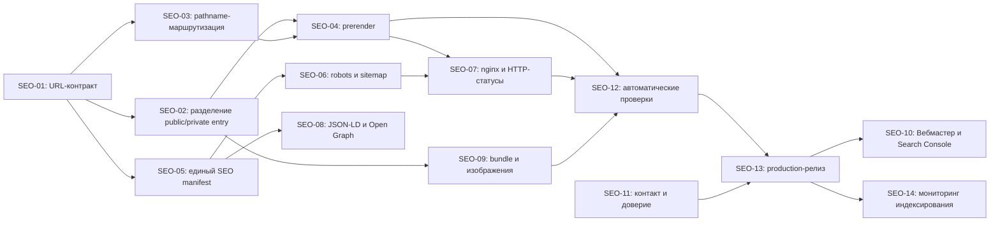

# Технический SEO-фундамент Support Communication

Статус: план к реализации
Дата: 2026-08-07
Горизонт: 2 календарные недели
Область: первая часть SEO-плана — индексирование, URL, метаданные, техническая доступность, производительность и подключение поисковых инструментов

## 1. Результат этапа

После завершения этапа публичная часть `supportcom.ru` должна:

- отдавать содержательный HTML без обязательного исполнения JavaScript;
- иметь обычные индексируемые URL без `#` для главной, тарифов и документации;
- возвращать уникальные `title`, `description`, `canonical`, Open Graph и структурированные данные для каждой публичной страницы;
- отдавать настоящий `robots.txt` и валидный XML `sitemap.xml`;
- возвращать корректные HTTP-статусы, включая `404` для несуществующих URL;
- не загружать основной код операторского рабочего места на публичных страницах;
- быть добавлена в Яндекс Вебмастер, Google Search Console и Яндекс Метрику;
- иметь автоматические проверки SEO-контрактов в CI и production smoke-проверках.

Этап считается завершённым не после добавления метатегов, а после проверки production-ответов `https://supportcom.ru` и принятия файлов Яндекс Вебмастером и Google Search Console.

## 2. Исходное состояние

Аудит на 2026-08-07 зафиксировал:

| Область | Текущее состояние | Последствие |
| --- | --- | --- |
| HTML главной | В исходном HTML только `<title>Support Communication</title>` и пустой `#root` | Основной текст появляется только после JavaScript-рендера |
| Маршруты | `#/landing`, `#/pricing`, `#/docs` | Поисковик не получает независимые серверные URL страниц |
| `robots.txt` | Возвращает HTML приложения с `200 text/html` | Правила обхода отсутствуют |
| `sitemap.xml` | Возвращает HTML приложения с `200 text/html` | Sitemap невалиден |
| Неизвестные URL | nginx возвращает `/index.html` | Возникают soft 404 и дубли главной |
| Метаданные | Нет description, canonical, Open Graph и JSON-LD | Слабое понимание страниц и неконтролируемые сниппеты |
| Публичный JavaScript | Основной bundle около 730 КБ до gzip | На лендинге загружается код, не относящийся к публичному сайту |
| Hero-изображение | PNG около 1,1 МБ | Риск ухудшения LCP на мобильных устройствах |
| Контакт | На сайте указан `sales@supportcomm.ru`, домен `supportcomm.ru` не существует | Потеря заявок и снижение доверия |
| Поисковые панели | Не подтверждено подключение Вебмастера, Search Console и Метрики | Нет данных об обходе, запросах и ошибках индексирования |

Затрагиваемые текущие компоненты:

- `index.html`;
- `src/main.jsx`;
- `src/App.jsx`;
- `src/app/useWorkspaceRoute.js`;
- `src/features/public/LandingPage.jsx`;
- `src/features/public/PricingPage.jsx`;
- `src/features/public/ApiDocsPage.jsx`;
- `vite.config.js`;
- `Dockerfile`;
- `docker/nginx.conf`;
- `docker/nginx.static.conf`;
- frontend-тесты и CI.

## 3. Архитектурное решение

### 3.1. Целевая схема

Использовать гибридную архитектуру:

- публичный сайт — обычные pathname-маршруты и статический HTML, сформированный при сборке;
- авторизованное рабочее место — существующая React SPA;
- service-admin — существующий отдельный MPA entry;
- backend и публичные API — без изменений.

Целевые публичные URL первого этапа:

| Страница | Канонический URL | Индексирование |
| --- | --- | --- |
| Главная | `https://supportcom.ru/` | `index,follow` |
| Тарифы | `https://supportcom.ru/pricing/` | `index,follow` |
| Документация/возможности API | `https://supportcom.ru/docs/` | `index,follow` |

Маршруты продукта на первом этапе остаются hash-маршрутами:

- `/#/app`;
- `/#/login`;
- `/#/onboarding`.

Это позволяет не переписывать маршрутизацию рабочего места одновременно с SEO-публичным контуром.

### 3.2. Совместимость со старыми ссылками

| Старый URL | Новое поведение |
| --- | --- |
| `/#/landing` | клиентский `replace` на `/` |
| `/#/pricing` | клиентский `replace` на `/pricing/` |
| `/#/docs` | клиентский `replace` на `/docs/` |
| `/landing` | HTTP 308 на `/` |
| `/pricing` | HTTP 308 на `/pricing/` |
| `/docs` | HTTP 308 на `/docs/` |
| `/app` | HTTP 308 на `/#/app` либо отдача SPA shell с `noindex`; выбрать один контракт и закрепить тестом |
| `/login`, `/auth` | HTTP 308 на `/#/login` |
| `/onboarding` | HTTP 308 на `/#/onboarding` |

Предпочтительный контракт для private path deep links — HTTP 308 на hash-адрес. Он проще, не создаёт индексируемых дублей и сохраняет текущую SPA-модель.

### 3.3. Предпочтительный способ генерации HTML

Не мигрировать проект на Next.js/Nuxt и не добавлять production Node SSR-сервер.

Предпочтительный вариант:

1. Создать отдельный публичный entry и компонент `PublicSiteApp`, который выбирает страницу по `window.location.pathname`.
2. Создать server entry с функцией `render(pathname)` на базе `react-dom/server`.
3. Во время сборки собрать временный SSR bundle через Vite.
4. Скриптом `scripts/prerender-public-pages.mjs` сформировать:
   - `dist/index.html`;
   - `dist/pricing/index.html`;
   - `dist/docs/index.html`.
5. Вставить в каждый документ готовый HTML страницы и её метаданные.
6. В браузере использовать `hydrateRoot` для статически сформированной публичной страницы.
7. Удалить временный SSR bundle перед сборкой Docker image.

Динамические данные, например состояние API и актуальные тарифы, после hydration загружаются как сейчас. В статическом HTML должны присутствовать H1, вводный текст, назначение продукта, стабильные возможности и CTA. Динамическая цена не должна становиться build-time копией, способной разойтись с каноническим тарифным каталогом.

## 4. Зависимости работ



## 5. Декомпозиция задач

### SEO-01. Зафиксировать URL-контракт

Приоритет: P0
Оценка: 3–4 часа
Зависимости: нет

Подзадачи:

1. Утвердить три индексируемых URL первого релиза: `/`, `/pricing/`, `/docs/`.
2. Утвердить завершающий `/` как канонический формат внутренних URL.
3. Составить таблицу старых hash/path адресов и целевых редиректов.
4. Утвердить, что `/service-admin`, `/api`, `/s3` и private deep links не индексируются.
5. Зафиксировать production origin `https://supportcom.ru`.
6. Добавить конфигурацию окружения:
   - `PUBLIC_SITE_ORIGIN`;
   - `PUBLIC_SITE_INDEXABLE`;
   - идентификаторы верификации поисковых панелей;
   - ID Метрики после его получения.
7. Для staging/dev установить `PUBLIC_SITE_INDEXABLE=false` и `noindex,nofollow`.

Артефакт:

- `src/public/publicRouteManifest.js` или эквивалентный единый manifest маршрутов.

Критерии приёмки:

- каждый публичный путь описан один раз и используется маршрутизатором, prerender, sitemap и тестами;
- канонический origin не вычисляется из произвольного входящего `Host`;
- staging не может случайно сгенерировать индексируемые canonical URL production-сайта.

### SEO-02. Разделить публичную и приватную загрузку приложения

Приоритет: P0
Оценка: 1–1,5 дня
Зависимости: SEO-01

Проблема:

Текущий `App.jsx` импортирует состояние и сервисы операторского рабочего места. Даже при lazy-loading экранов публичная страница получает слишком большой общий bundle.

Подзадачи:

1. Выделить `PublicSiteApp` с зависимостями только от:
   - `LandingPage`;
   - `PricingPage`;
   - `ApiDocsPage`;
   - публичной формы заявки;
   - минимального toast/UI-кода.
2. Создать маленький bootstrap, определяющий public/private surface до загрузки основного приложения.
3. Для `/`, `/pricing/`, `/docs/` динамически загружать только public entry.
4. Для hash-маршрутов приложения динамически загружать существующий основной `App`.
5. Не инициировать `useTenantSessionState` и другие private API-запросы на публичных URL.
6. Проверить сохранение источников лидов `landing-hero`, `landing-tariff`, `pricing-*`.
7. Сохранить текущие auth/onboarding сценарии без изменения API-контрактов.

Предполагаемые файлы:

- новый `src/bootstrap.jsx`;
- новый `src/public/PublicSiteApp.jsx`;
- новый `src/public-entry.jsx`;
- изменение `src/main.jsx`;
- упрощение публичной ветки `src/App.jsx` либо её удаление после переноса.

Критерии приёмки:

- public entry не импортирует inbox, reports, automation, quality и настройки рабочего места;
- открытие `/#/app` загружает полный продукт и не регрессирует;
- открытие `/` не вызывает tenant-session запросы;
- публичный initial JS после gzip измерен и записан в итоговый отчёт;
- функциональные CTA и форма демо работают как до разделения.

### SEO-03. Перевести публичную маршрутизацию на pathname

Приоритет: P0
Оценка: 1 день
Зависимости: SEO-01

Подзадачи:

1. На публичном контуре читать `window.location.pathname`, а не hash.
2. Заменить ссылки:
   - `#/landing` → `/`;
   - `#/pricing` → `/pricing/`;
   - `#/docs` → `/docs/`.
3. Сохранить кнопочные переходы на login/onboarding через private hash routes.
4. Добавить клиентскую нормализацию legacy hash URL с `history.replaceState`.
5. Удалить обратное преобразование `/pricing` и `/docs` в hash из `normalizeDeepLinkPath`.
6. Обновить тесты, которые открывают `/#/landing`.
7. Убедиться, что browser back/forward корректно работает между публичными страницами.
8. Убедиться, что якоря главной (`#channels`, `#capabilities`, `#faq`) не воспринимаются как маршруты.

Затрагиваемые файлы:

- `src/app/useWorkspaceRoute.js`;
- `src/features/public/LandingPage.jsx`;
- `src/features/public/PricingPage.jsx`;
- `src/features/public/ApiDocsPage.jsx`;
- `tests/smoke.spec.js`;
- `tests/settings-runtime.spec.js` и другие тесты с `/#/landing`.

Критерии приёмки:

- `/pricing/` можно открыть напрямую и после перезагрузки;
- `/docs/` можно открыть напрямую и после перезагрузки;
- ссылки публичной навигации содержат обычные `href` и доступны без JavaScript;
- в sitemap нет URL с `#`;
- legacy hash-ссылки продолжают приводить пользователя на нужную страницу.

### SEO-04. Реализовать build-time prerender

Приоритет: P0
Оценка: 2 дня
Зависимости: SEO-02, SEO-03

Подзадачи:

1. Создать SSR-safe server entry для трёх публичных страниц.
2. Устранить обращения к `window`, `document`, `navigator` во время server render; оставить их внутри эффектов и event handlers.
3. Реализовать `render(pathname)` через `renderToString` или `renderToStaticMarkup` с последующей hydration.
4. Создать build script, который:
   - читает route manifest;
   - рендерит страницу;
   - формирует head;
   - записывает HTML по целевому пути;
   - завершает сборку с ошибкой при пустом H1 или root markup.
5. Изменить `npm run build`, включив client build, SSR build, prerender и SEO verification.
6. Изменить Docker build так, чтобы prerender входил в production image.
7. Не выполнять build-time запросы к production API.
8. На pricing prerender оставить стабильный вводный контент и подпись загрузки актуального каталога; после hydration загрузить цены из `/public/catalog/tariffs`.
9. Проверить отсутствие hydration mismatch в консоли.

Предполагаемые файлы:

- новый `src/public-server-entry.jsx`;
- новый `scripts/prerender-public-pages.mjs`;
- изменение `vite.config.js`;
- изменение `package.json`;
- изменение `Dockerfile`.

Критерии приёмки:

- `dist/index.html`, `dist/pricing/index.html` и `dist/docs/index.html` содержат видимый H1 и основной текст;
- при отключённом JavaScript пользователь видит назначение страницы, навигацию и основные возможности;
- hydration не заменяет страницу пустым состоянием;
- сборка не зависит от доступности production API;
- временные SSR-артефакты не попадают в final image.

### SEO-05. Создать единый manifest метаданных

Приоритет: P0
Оценка: 0,5–1 день
Зависимости: SEO-01

Рекомендуемый начальный набор:

| URL | Title | H1 |
| --- | --- | --- |
| `/` | `Омниканальная поддержка клиентов в одном окне \| Support Communication` | `Обращения из MAX, Telegram, VK и сайта — в одном окне поддержки` |
| `/pricing/` | `Тарифы платформы поддержки клиентов \| Support Communication` | Сохранить смысл текущего H1, сократив его до прямой формулировки о тарифах |
| `/docs/` | `API и интеграции платформы поддержки \| Support Communication` | Прямая формулировка о подключении каналов и API |

Для каждой страницы manifest должен содержать:

- pathname;
- title;
- description;
- canonical;
- robots;
- H1 contract;
- Open Graph title/description/type/image;
- breadcrumb label;
- флаг включения в sitemap;
- тип JSON-LD.

Подзадачи:

1. Согласовать финальный текст title и description с владельцем продукта.
2. Ограничить title ориентиром 50–70 символов, description — 120–170 символов без механического обрезания.
3. Генерировать canonical из `PUBLIC_SITE_ORIGIN` и pathname.
4. Не добавлять keywords meta tag: он не даёт современного SEO-эффекта.
5. Не добавлять неподтверждённые рейтинги, отзывы и числа.
6. Добавить `lang="ru"`, `theme-color`, favicon и manifest без дублей.
7. Добавить `og:locale=ru_RU`, `twitter:card=summary_large_image`.

Критерии приёмки:

- у каждой публичной страницы ровно один title, description и canonical;
- metadata присутствует в исходном HTML до JavaScript;
- canonical не содержит hash, query или staging host;
- публичные страницы не используют одинаковые title/description;
- тексты соответствуют реально работающим каналам.

### SEO-06. Создать настоящие robots.txt и sitemap.xml

Приоритет: P0
Оценка: 0,5 дня
Зависимости: SEO-01, SEO-05

Рекомендуемый production `robots.txt`:

```text
User-agent: *
Allow: /
Disallow: /api/
Disallow: /s3/
Disallow: /service-admin/

Sitemap: https://supportcom.ru/sitemap.xml
Host: supportcom.ru
```

Примечания:

- не запрещать `/assets/`, JS, CSS и изображения;
- private hash-маршруты нельзя надёжно закрыть через robots, потому что fragment не отправляется серверу;
- `Host` полезен для Яндекса, но canonical и редиректы остаются основными сигналами;
- staging должен отдавать `Disallow: /` и meta `noindex,nofollow`.

Подзадачи:

1. Генерировать sitemap из route manifest, а не вести отдельный список вручную.
2. Включить только канонические `200 OK` страницы.
3. Не включать auth, app, onboarding, service-admin и API.
4. Не указывать `lastmod`, пока нет надёжного источника даты содержательного изменения.
5. Отдавать `robots.txt` как `text/plain; charset=utf-8`.
6. Отдавать `sitemap.xml` как `application/xml` или `text/xml`.
7. Добавить build verification XML-синтаксиса.

Предполагаемые файлы:

- новый `scripts/generate-public-seo-files.mjs`;
- генерируемые `dist/robots.txt`, `dist/sitemap.xml`;
- тесты генератора.

Критерии приёмки:

- `/robots.txt` не содержит HTML;
- `/sitemap.xml` начинается с XML declaration и содержит три canonical URL;
- все URL sitemap возвращают `200` и self-canonical;
- sitemap проходит валидатор Яндекс Вебмастера;
- robots содержит абсолютный адрес sitemap.

### SEO-07. Настроить nginx, редиректы и HTTP-статусы

Приоритет: P0
Оценка: 1 день
Зависимости: SEO-03, SEO-04, SEO-06

Подзадачи:

1. В обоих nginx-конфигах добавить явные правила для `/`, `/pricing/`, `/docs/`.
2. Добавить 308-редиректы для вариантов без завершающего `/`.
3. Добавить редирект `/landing` → `/`.
4. Добавить обработку private legacy paths по URL-контракту.
5. Для `/assets/` возвращать реальный файл или `404`, без fallback на главную.
6. Для неизвестных URL возвращать `404`, а не `/index.html` с кодом `200`.
7. Создать лёгкую `404.html` с ссылками на главную и тарифы; установить `noindex`.
8. Добавить `X-Robots-Tag: noindex, nofollow` для service-admin и технических поверхностей там, где это не мешает API-клиентам.
9. Настроить кэширование:
   - hashed assets: `public, max-age=31536000, immutable`;
   - HTML: `no-cache` или короткий TTL с revalidation;
   - robots/sitemap: короткий TTL;
   - 404: без длительного кэша.
10. Сохранить существующие CSP и proxy-настройки.
11. Проверить фактический Caddy edge на RUVDS: он должен передавать path без переписывания и не подменять content type.

Затрагиваемые файлы:

- `docker/nginx.conf`;
- `docker/nginx.static.conf`;
- новая `public/404.html` либо генерируемая `dist/404.html`;
- production smoke script.

Критерии приёмки:

- `/missing-page-unique-test` возвращает `404`;
- `/assets/missing.js` возвращает `404`, не HTML приложения;
- `/pricing` возвращает один 308 на `/pricing/`;
- `/pricing/` возвращает prerendered HTML с `200`;
- `/robots.txt` и `/sitemap.xml` имеют корректные content type;
- API, SSE, S3 upload и service-admin продолжают работать.

### SEO-08. Добавить структурированные данные и social preview

Приоритет: P1
Оценка: 0,5–1 день
Зависимости: SEO-05

Подзадачи:

1. На главной добавить JSON-LD:
   - `Organization`;
   - `WebSite`;
   - `SoftwareApplication` с `applicationCategory: BusinessApplication`.
2. На pricing/docs добавить `BreadcrumbList`.
3. Не добавлять `AggregateRating`, пока нет проверяемых отзывов.
4. Не добавлять фиктивные клиенты, проценты и цены в JSON-LD.
5. Указывать Offer только для тарифа, цена которого гарантированно совпадает с каноническим каталогом; иначе отложить Offer.
6. Подготовить одно брендированное OG-изображение 1200×630 в WebP/JPEG с весом до 200 КБ.
7. Проверить абсолютный URL OG-изображения.
8. Проверить JSON-LD через schema validator и Rich Results Test, не ожидая гарантированного расширенного сниппета.

Критерии приёмки:

- JSON-LD валиден и соответствует видимому содержимому;
- на странице нет выдуманных rating/review/offers;
- Telegram, VK и другие клиенты предпросмотра показывают корректное изображение и описание;
- structured data присутствует в исходном HTML.

### SEO-09. Сократить public bundle и улучшить загрузку

Приоритет: P1
Оценка: 1–1,5 дня
Зависимости: SEO-02

Подзадачи:

1. Зафиксировать baseline через Lighthouse mobile минимум в трёх прогонах.
2. Зафиксировать transfer size публичного JS, CSS и hero asset.
3. Исключить private workspace code из public bundle.
4. Конвертировать `operator-cockpit-concept.png` в WebP/AVIF с визуальной проверкой.
5. Добавить корректные `width`/`height` либо `aspect-ratio` изображения, чтобы уменьшить CLS.
6. Добавить responsive `srcset`, если hero отображается существенно меньше оригинала.
7. Не использовать lazy-loading для изображения, являющегося LCP; использовать приоритетную загрузку только после измерения.
8. Lazy-load изображения и секции ниже первого экрана, где это даёт эффект.
9. Проверить, какие CSS и icon imports попадают в initial chunk.
10. Настроить Brotli/gzip на фактическом production proxy, если сжатие отсутствует.
11. Повторить Lighthouse после production-релиза.

Целевые ориентиры, не безусловные release blockers:

- initial public JS: снижение минимум на 40% относительно baseline;
- hero asset: до 250 КБ, желательно до 150 КБ;
- Lighthouse Performance mobile: не ниже 80 в стабильных условиях;
- SEO и Accessibility: не ниже 95;
- отсутствие layout shift от hero и навигации.

Критерии приёмки:

- в отчёте есть baseline и after для одинакового устройства/сети;
- оптимизированное изображение визуально проверено;
- публичная страница не загружает код диалогов, отчётов и администрирования;
- функциональность после code splitting покрыта smoke-тестами.

### SEO-10. Подключить поисковые панели и аналитику

Приоритет: P0 после production-релиза
Оценка разработки: 0,5 дня
Оценка внешних действий: 2–4 часа
Зависимости: production-доступ, SEO-13

Внешние prerequisites:

- владелец аккаунта Яндекса;
- владелец Google-аккаунта;
- доступ к DNS `supportcom.ru` или возможность разместить verification meta/file;
- решение о политике обработки аналитических cookies.

Подзадачи:

1. Добавить сайт в Яндекс Вебмастер.
2. Подтвердить права DNS TXT или HTML meta/file.
3. Добавить и проверить sitemap.
4. Выполнить проверку ответа сервера для `/`, `/pricing/`, `/docs/`, robots и sitemap.
5. Отправить три страницы на переобход.
6. Добавить domain property в Google Search Console.
7. Подтвердить права через DNS TXT.
8. Отправить sitemap в Search Console.
9. Создать счётчик Яндекс Метрики.
10. Загружать Метрику только на публичной поверхности и только в рамках принятой consent-модели.
11. Настроить цели:
    - начало бесплатной регистрации;
    - открытие формы демо;
    - успешная отправка формы демо;
    - переход к входу;
    - просмотр pricing;
    - просмотр docs.
12. Не передавать email, телефон, имя, текст обращения и другие PII в параметры аналитики.
13. Проверить отсутствие двойного pageview при hydration и client navigation.

Критерии приёмки:

- права подтверждены в обеих поисковых панелях;
- sitemap принят без ошибок формата;
- Метрика получает один pageview на загрузку;
- цели срабатывают один раз и не содержат PII;
- идентификаторы хранятся как публичная конфигурация, секреты в frontend не добавлены.

### SEO-11. Исправить контактный домен и сигналы доверия

Приоритет: P0 до production-релиза
Оценка разработки: 1–2 часа
Внешняя зависимость: владелец почтовой инфраструктуры

Подзадачи:

1. Определить канонический бренд и домен:
   - сайт `supportcom.ru`;
   - текущее отображение `supportcomm.ru`;
   - Telegram `@supportcomm`.
2. Предпочтительно создать рабочий адрес `sales@supportcom.ru`.
3. Настроить MX/SPF/DKIM/DMARC до публикации адреса.
4. Выполнить реальную тестовую доставку в обе стороны.
5. Только после успешного теста заменить email на сайте.
6. Если должен использоваться `supportcomm.ru`, сначала зарегистрировать и настроить домен, затем сделать редирект на канонический сайт.
7. Проверить одинаковое написание бренда в title, Organization JSON-LD, footer и социальных профилях.
8. Сохранить маркировку демонстрационных отзывов и логотипов; не включать их в structured data.

Критерии приёмки:

- опубликованный email принимает письма;
- домен email не возвращает NXDOMAIN;
- каноническое имя компании единообразно;
- фиктивная социальная доказательность не представлена как реальная.

### SEO-12. Добавить автоматические SEO-проверки

Приоритет: P0
Оценка: 1–1,5 дня
Зависимости: SEO-03–SEO-09

Уровень 1 — build contracts:

1. Все индексируемые маршруты имеют title, description, canonical и H1 contract.
2. Title/description не дублируются.
3. Canonical начинается с разрешённого origin и не содержит `#`.
4. Sitemap содержит только существующие indexable routes.
5. robots ссылается на тот же sitemap origin.
6. Prerendered HTML содержит H1 и минимальный объём видимого текста.
7. JSON-LD парсится как JSON.
8. Production build не содержит staging canonical.

Уровень 2 — Playwright:

1. Открыть `/`, `/pricing/`, `/docs/`.
2. Проверить canonical и document title.
3. Отключить JavaScript и проверить наличие H1, навигации и основного текста.
4. Проверить public navigation и browser history.
5. Проверить legacy hash normalization.
6. Проверить CTA, demo form и переходы login/onboarding.
7. Проверить отсутствие console hydration errors.
8. Проверить responsive layout на mobile/desktop.

Уровень 3 — HTTP/container smoke:

1. Проверить status и content type robots/sitemap.
2. Проверить 308 для URL без завершающего `/`.
3. Проверить 404 для случайного URL и отсутствующего asset.
4. Проверить кеш-заголовки HTML и hashed assets.
5. Проверить `X-Robots-Tag` технических страниц.
6. Проверить API readiness, SSE и service-admin после изменения nginx.

Предполагаемые файлы:

- новый `scripts/verify-public-seo.mjs`;
- новый `tests/public-seo.spec.js`;
- новый `tests/public-seo-build-contract.test.js`;
- обновление `.github/workflows/ci.yml`;
- добавление SEO smoke в `scripts/release-gate.mjs`.

Критерии приёмки:

- любой пропущенный canonical/H1 ломает CI;
- неправильный HTML в robots/sitemap ломает CI;
- soft 404 определяется container smoke-тестом;
- текущий unit/smoke набор не регрессирует.

### SEO-13. Провести безопасный production-релиз

Приоритет: P0
Оценка: 0,5–1 день
Зависимости: SEO-11, SEO-12

Подготовка:

1. Собрать immutable frontend image с release tag.
2. Сохранить предыдущий рабочий image tag для rollback.
3. Проверить release gate и targeted SEO tests.
4. Проверить, что `supportcom.ru` обслуживается напрямую RUVDS production Compose/Caddy: DNS должен указывать на RUVDS, а `/api/v1/ready` — отвечать без reverse-SSH-туннеля или nginx-proxy-manager.
5. Проверить через Caddy, что `/robots.txt`, `/sitemap.xml`, `/pricing/` и `/docs/` отдаются без неожиданных rewrite или fallback.
6. Согласовать короткое окно релиза.

Порядок проверки после выкладки:

1. `/api/v1/ready` и frontend healthcheck.
2. Главная, pricing, docs — status, canonical, H1 в source.
3. robots и sitemap — content type и содержимое.
4. Неизвестный URL — 404.
5. Login, onboarding, app.
6. Demo request.
7. Service-admin.
8. SSE/API/S3 smoke в объёме текущего release gate.
9. Lighthouse mobile.
10. Проверка логов nginx и браузерной консоли.

Rollback-триггеры:

- публичные страницы возвращают 5xx;
- app/login/onboarding недоступны;
- hydration ломает CTA или форму;
- API/SSE/S3/service-admin регрессировали;
- canonical ведёт на staging или другой домен;
- robots закрывает весь production-сайт;
- sitemap содержит несуществующие URL.

Rollback:

1. Вернуть предыдущий frontend image tag.
2. Не откатывать backend, если backend не менялся.
3. Повторить readiness и public smoke.
4. Зафиксировать причину и блокировать повторный релиз до исправления автоматической проверки.

### SEO-14. Мониторить обход и индексирование первые 14 дней

Приоритет: P1
Оценка: 15–20 минут в рабочий день
Зависимости: SEO-10, SEO-13

Проверять:

- обработку sitemap;
- последние обходы robots и публичных страниц;
- исключённые страницы и причины исключения;
- выбранный поисковиком canonical;
- JavaScript rendering в Яндекс Вебмастере;
- Core Web Vitals и mobile usability;
- показы и запросы без бренда;
- 404/5xx в nginx;
- неожиданный рост обхода технических URL;
- дубли с hash/query и URL без завершающего `/`.

Контрольные точки:

- день релиза: серверные ответы и отправка sitemap;
- +2 рабочих дня: проверка загрузки файлов роботами;
- +7 дней: первый отчёт об обходе и исключениях;
- +14 дней: решение, готов ли сайт к публикации коммерческих посадочных страниц второй фазы.

## 6. План по рабочим дням

План предполагает одного frontend/full-stack инженера и part-time участие DevOps/владельца домена. Для одного инженера без DevOps-помощи реалистичная длительность — 12–15 рабочих дней.

| День | Основной результат | Задачи |
| --- | --- | --- |
| 1 | Утверждён URL-контракт и route manifest | SEO-01, начало SEO-11 |
| 2 | Публичный контур отделён от private workspace | SEO-02 |
| 3 | Pathname-маршруты и legacy compatibility | SEO-03, unit-тесты |
| 4 | SSR-safe public entry и первый prerender | SEO-04 |
| 5 | Три готовых prerendered HTML | SEO-04, начало SEO-05 |
| 6 | Метаданные, canonical, OG, JSON-LD | SEO-05, SEO-08 |
| 7 | robots, sitemap, nginx, 404 и redirects | SEO-06, SEO-07 |
| 8 | Bundle split и оптимизация hero | SEO-09 |
| 9 | Полный test/CI/release gate | SEO-12 |
| 10 | Staging/production release и smoke | SEO-13 |
| После релиза | Панели поиска и ежедневное наблюдение | SEO-10, SEO-14 |

Если SEO-02 или SEO-04 занимают больше оценки, SEO-09 переносится после production-релиза, но prerender, canonical, robots, sitemap, корректные статусы и CI остаются обязательными.

## 7. Матрица проверок

| Проверка | Local build | Container | Staging | Production |
| --- | --- | --- | --- | --- |
| HTML содержит H1 без JS | Да | Да | Да | Да |
| Уникальные title/description | Да | Да | Да | Да |
| Canonical соответствует окружению | Да | Да | Да | Да |
| robots/sitemap валидны | Да | Да | Да | Да |
| Staging закрыт от индексации | — | — | Да | — |
| Unknown URL возвращает 404 | — | Да | Да | Да |
| Redirect matrix | — | Да | Да | Да |
| Public/private bundle split | Да | Да | Да | Да |
| CTA и demo form | Да | Да | Да | Да |
| App/login/onboarding | Да | Да | Да | Да |
| API/SSE/S3/service-admin | Частично | Да | Да | Да |
| Lighthouse mobile | Baseline | — | Желательно | Да |
| Sitemap принят панелями | — | — | — | Да |

## 8. Production smoke-команды

Примеры проверок после релиза:

```bash
curl -sS https://supportcom.ru/ | grep -E '<title>|<h1|canonical|application/ld\+json'
curl -sS https://supportcom.ru/pricing/ | grep -E '<title>|<h1|canonical'
curl -sS https://supportcom.ru/docs/ | grep -E '<title>|<h1|canonical'
curl -i https://supportcom.ru/robots.txt
curl -i https://supportcom.ru/sitemap.xml
curl -I https://supportcom.ru/pricing
curl -I https://supportcom.ru/missing-page-seo-smoke
curl -I https://supportcom.ru/assets/missing-seo-smoke.js
```

Ожидаемые результаты:

- HTML уже содержит H1 и metadata;
- robots — `200` и `text/plain`;
- sitemap — `200` и XML content type;
- `/pricing` — один 308 на `/pricing/`;
- случайная страница и отсутствующий asset — `404`;
- в ответах нет staging canonical.

## 9. Метрики результата первой фазы

Технические release metrics:

- 3 из 3 публичных URL имеют prerendered HTML;
- 3 из 3 URL имеют уникальные metadata и self-canonical;
- 0 hash URL в sitemap;
- 0 soft 404 в тестовой матрице;
- robots и sitemap проходят автоматическую и панельную валидацию;
- public bundle уменьшен относительно baseline;
- нет регрессий критических пользовательских сценариев.

Поисковые leading indicators на горизонте 14 дней:

- sitemap загружен обоими поисковиками;
- все три страницы обнаружены роботами;
- поисковики выбирают заданные canonical;
- отсутствуют блокирующие ошибки JavaScript rendering;
- появляются первые impressions по брендовым и релевантным запросам.

Позиции по конкурентным запросам не являются критерием этой фазы: контентные посадочные страницы создаются на следующем этапе.

## 10. Риски и меры снижения

| Риск | Вероятность/влияние | Снижение |
| --- | --- | --- |
| Hydration mismatch из-за browser-only кода | Средняя/высокое | Отдельный SSR-safe public entry, console test в Playwright |
| Динамические тарифы расходятся с prerender | Средняя/высокое | Не копировать цены на build-time; загружать из canonical API после hydration |
| Private app ломается при разделении entry | Средняя/высокое | Сохранить hash-контракт, targeted app/login/onboarding smoke |
| nginx fallback продолжает отдавать soft 404 | Высокая/высокое | Явные location и HTTP smoke для случайного URL |
| Staging индексируется | Средняя/высокое | `PUBLIC_SITE_INDEXABLE=false`, noindex, закрывающий robots, CI contract |
| Production NPM переписывает path/content type | Средняя/высокое | Проверка фактического маршрута и live headers до отправки sitemap |
| Неверный canonical host | Средняя/высокое | Обязательный build arg и allowlist origin |
| Метрика получает PII | Низкая/высокое | Запрет полей форм в событиях, тест payload и code review |
| Фиктивные отзывы попадают в schema | Средняя/высокое | Явный запрет AggregateRating/Review в CI до появления реальных данных |
| Двух недель недостаточно одному инженеру | Средняя/среднее | P0 прежде P1; SEO-09 допускается вынести после релиза |

## 11. Вне области первой фазы

На этом этапе не выполняются:

- массовое создание коммерческих посадочных страниц;
- блог и редакционный календарь;
- страницы сравнений с конкурентами;
- link building и размещение в каталогах;
- Яндекс Директ;
- миграция private workspace с hash на полный path router;
- переход проекта на Next.js или другой web framework;
- заявления о 152-ФЗ, реестре отечественного ПО или on-prem без отдельного подтверждения;
- публикация неподтверждённых кейсов, рейтингов и клиентских логотипов.

## 12. Definition of Done

Первая фаза завершена, когда одновременно выполнены все условия:

- [ ] `/`, `/pricing/`, `/docs/` открываются прямыми URL и после reload;
- [ ] их исходный HTML содержит H1 и основной текст;
- [ ] каждая страница имеет уникальные title, description и self-canonical;
- [ ] metadata и JSON-LD присутствуют до исполнения JavaScript;
- [ ] старые публичные hash-ссылки приводят на канонические URL;
- [ ] внутренние публичные ссылки не используют hash routing;
- [ ] production robots.txt является текстовым файлом;
- [ ] production sitemap.xml является валидным XML;
- [ ] sitemap содержит только канонические indexable URL;
- [ ] неизвестные URL и assets возвращают 404;
- [ ] staging закрыт от индексирования;
- [ ] public bundle не включает основное рабочее место;
- [ ] hero asset оптимизирован и визуально проверен;
- [ ] demo form, регистрация, login, onboarding и app прошли smoke;
- [ ] API, SSE, S3 и service-admin не регрессировали;
- [ ] SEO-проверки входят в CI/release gate;
- [ ] опубликованный email существует и принимает письма;
- [ ] сайт подтверждён в Яндекс Вебмастере и Google Search Console;
- [ ] sitemap принят поисковыми панелями;
- [ ] Метрика работает без PII и двойных pageview;
- [ ] сохранён production baseline/after отчёт;
- [ ] определён владелец мониторинга на следующие 14 дней.

## 13. Итоговые артефакты

К концу этапа должны существовать:

1. URL/SEO manifest в репозитории.
2. Отдельный public entry и private bootstrap.
3. Build-time prerender pipeline.
4. Три prerendered публичные страницы.
5. Генератор metadata, robots и sitemap.
6. Валидные JSON-LD и OG-изображение.
7. Обновлённые nginx-конфиги и 404 page.
8. Build, Playwright и HTTP SEO-тесты.
9. Обновлённый CI/release gate.
10. Production smoke-протокол.
11. Подключённые поисковые панели и Метрика.
12. Краткий отчёт `baseline → after` с размерами ресурсов, Lighthouse и статусом индексирования.
