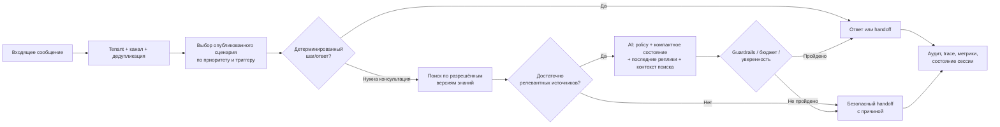

# Руководство для агентов: реализация продуктового раздела «Боты» и AI-консультанта

> **Статус:** исполнимый backlog.
> **Назначение:** единый ориентир для агентов, реализующих продукт, а не только его интерфейс.
> **Связанный продуктовый план:** [план развития AI-ботов](2026-07-12-bots-ai-agent-product-plan.md).
> **Обновлено:** 12 июля 2026.

## 1. Как пользоваться этим документом

Этот документ превращает продуктовый план в порядок разработки. Агент берёт только незаблокированную задачу, выполняет её вместе с указанными тестами и отмечает чекбокс **только после** того, как код, миграция, документация и проверки действительно готовы.

Если требования противоречат друг другу, применять источники в следующем порядке:

1. Подтверждённые продуктовые решения в разделе 2 этого документа.
2. [Функциональные требования платформы](../../functional-requirements-support-communication-platform.md) — роли, права, безопасность, доступность и критерии приёмки.
3. [Техническое описание проекта](../../project-documentation-ru.md) — реальная архитектура, API, данные и сценарии эксплуатации.
4. [Продуктовый план AI-ботов](2026-07-12-bots-ai-agent-product-plan.md) — UX, этапы поставки, исследовательские выводы и ссылки на первоисточники.
5. [План frontend-разработки](../../frontend-development-plan.md) и [план backend-разработки](../../backend-development-plan.md) — уже принятые подходы к поставке.
6. [Карта владения БД](../../../backend/docs/database-ownership-map.md), [runtime-конфигурация](../../runtime-configuration.md) и актуальные миграции — источник истины для конкретных таблиц, процессов и переменных окружения.

Перед изменением схемы, публичного API или модели прав агент обязан проверить эти документы и соседние тесты. Если решение не определено, не следует молча выбирать удобный вариант: добавить ADR в рамках задачи `BAI-001` и вынести вопрос владельцу продукта.

## 2. Зафиксированный продуктовый контракт

### Что получает клиент

- Администратор клиента без кода создаёт, проверяет, публикует, отключает, редактирует и удаляет сценарий.
- Для каждого сценария понятно: **когда** он сработает, **что** бот сделает, **на каких знаниях** ответит, **когда** позовёт человека и **почему** он дал такой ответ.
- Ключевая фраза — это не радиокнопка. Администратор вводит одну или несколько фраз, видит режим совпадения, примеры подходящих и неподходящих сообщений, приоритет и действие при неоднозначности.
- Бот сначала применяет детерминированное правило, затем — при включённом AI — отвечает только на основе разрешённых источников знаний. Если источников недостаточно, он честно сообщает об этом и передаёт разговор человеку согласно настройке.
- Пользователь может связать сценарий с документами, URL и разрешёнными read-only MCP-инструментами. Сценарий не получает доступ к основной CRM клиента в первом релизе и не может менять внешние данные.
- Владелец продукта видит тестовый прогон, состояние публикации, последние ошибки, передачи оператору, использованные источники и расход AI.

### Что получает администратор сервиса

- В Service Admin он настраивает разрешённое AI-подключение для отдельного тенанта: провайдер, base URL, модель, ключ, лимиты, разрешённые возможности и статус проверки.
- Ключ доступен только для ввода и ротации: интерфейс и API никогда не возвращают его, журнал аудита не содержит секрет или исходный prompt.
- Он может включать функцию по тенантам через feature flag, задавать бюджет/ограничения и отключать неисправное подключение без удаления клиентских сценариев.

### Не входит в первый релиз

- Запись в CRM, изменение заказов, платежи и любые иные write-операции во внешних системах.
- Самостоятельные действия модели вне явно настроенного сценария.
- Неограниченный доступ к произвольному URL, произвольному MCP-серверу или данным другого тенанта.

## 3. Непереговорные принципы продукта и реализации

1. **Простота вместо конструктора для разработчиков.** Стартовый путь — мастер и понятные поля; canvas, JSON и расширенные параметры — только в режиме «Дополнительно».
2. **Прогрессивное раскрытие.** Пользователь сначала отвечает на «зачем», «когда», «что ответить» и «когда передать человеку». Технические детали не блокируют создание первого черновика.
3. **Безопасность и изоляция по умолчанию.** Любая сущность, запрос, кэш, очередь, векторный поиск, trace и секрет имеют tenant scope. Отсутствие scope — ошибка, а не глобальный доступ.
4. **Объяснимость.** Рядом с AI-ответом хранится и показывается причина: правило запуска, модель, версия политики, версия знаний, выбранные источники и причина передачи оператору. Клиенту не показываются секреты и внутренние системные инструкции.
5. **Человек остаётся контуром безопасности.** Низкая уверенность, отсутствие релевантных источников, запрещённая тема, ошибка поставщика, превышение лимита или просьба клиента — безопасная передача оператору.
6. **Источники важнее правдоподобного ответа.** Нельзя выдавать ответ как факт, если он не подтверждён разрешённым знанием. Ответ без опоры — краткое признание ограничения и handoff, а не выдумывание.
7. **Стоимость — функция архитектуры.** Не отправлять всю историю диалога, все документы или один и тот же большой prompt при каждом сообщении. Сначала детерминированные правила и поиск, затем минимальный контекст для модели.
8. **Проверяемость до публикации.** Нельзя опубликовать сценарий, если не заданы канал, триггер, безопасный fallback/handoff, а для AI — рабочее подключение и хотя бы один готовый источник.
9. **Безопасное удаление.** Действие «Удалить» в клиентском интерфейсе архивирует сценарий и немедленно выключает его. Восстановление возможно в срок хранения; окончательное purge выполняется только контролируемой фоновой процедурой с аудитом.
10. **Совместимость и постепенный rollout.** Все миграции аддитивны, старые сценарии продолжают исполняться, а новая функциональность включается feature flag-ом по тенантам.

## 4. Целевая последовательность обработки обращения

Для нового пользователя не существует скрытого «общего контекста прошлого пользователя». Долгоживущий контекст сохраняется только внутри его диалога и tenant scope в виде компактного состояния, а не как повторная пересылка полного транскрипта модели.

## 5. Инвентаризация текущего кода: что переиспользовать и что менять

| Область | Уже есть и можно использовать | Требуемая доработка / ограничение |
| --- | --- | --- |
| Экран «Боты» | `src/features/automation/AutomationScreen.jsx`, `automation.css`, общий `ScreenStateStrip`, проверки ролей и состояния загрузки | Сделать список сценариев главным экраном, добавить действия «Редактировать», «Дублировать», «Включить/выключить», «Удалить», статусы, пустое состояние, список запусков и понятную публикацию. Canvas и импорт JSON убрать из первого маршрута пользователя. |
| Мастер сценария | `src/features/automation/ScenarioCreationWizard.jsx` уже создаёт черновик в четыре понятных шага; `automationModel.js` содержит варианты целей, триггеров и handoff | Подключить к фактическому контракту: ввод фраз, режим совпадения, приоритет, AI/источники, fallback, валидация, preview с реальными данными. Сейчас выбор «ключевой фразы» не собирает фразы и не исполняется runtime. |
| Frontend API | `src/services/automationService.js`, `src/app/automationScenarioActions.js` и общий `apiRequest` | Добавить list/get/delete/archive/restore, состояния публикации, preview триггера, источники, тесты и usage. Не маскировать ошибку сети локальным успехом. |
| Контракт и жизненный цикл сценария | `backend/apps/api-gateway/src/automation/automation.controller.ts`, `automation.service.ts`, `automation.repository.ts`, `automation.types.ts`, существующие create/update/publish/test routes и версии | Расширить контракт trigger/policy/source binding/revision, добавить безопасное удаление и восстановление, явное выключение, детерминированный выбор сценария, tenant-scoped list/detail. Сохранить идемпотентность publish/test и version pinning. |
| Runtime и worker | `bot-runtime.service.ts`, `bot-runtime.worker.ts`, reconciliation worker, runtime-descriptors и Prisma/JSON адаптеры | Переиспользовать дедупликацию eventId, retry/dead-letter, pin опубликованной версии, redaction и handoff. Заменить текущий выбор «первый опубликованный сценарий в канале» на матчинг правил. Добавить AI-node, retrieval, trace, policy checks и session state. Сейчас runtime не вызывает LLM и не ищет знания. |
| Existing flow nodes | Узлы `message`, `quick_replies`, `contact_request`, `condition`, `webhook`, `handoff`, `fallback` и валидация flow | Сохранить для legacy/advanced режимов. Для первого AI-релиза добавить понятный узел «Консультация по знаниям» и запрещать AI write-инструменты. Не расширять webhook до обхода source/MCP policy. |
| База знаний | `src/features/quality/KnowledgeBaseWorkspace.jsx`, `src/services/knowledgeService.js`, `src/app/knowledgeArticleActions.js`; backend `workspace/knowledge.controller.ts`, миграции knowledge articles/draft versions/approval decisions | Переиспользовать жизненный цикл черновик–проверка–публикация, tenant scope и UI редактирования. Добавить каталог источников, ingestion jobs, документацию/URL/MCP connectors, chunk/version metadata, retrieval API и привязку источников к сценарию. Нынешняя база знаний не подключена к ботам. |
| Quality AI | `quality-scoring.openai-provider.ts`, adapter/provider interfaces, timeout/retry/rate limit, redaction и контрактные тесты | Использовать паттерн адаптера OpenAI-compatible, но **не** подключать runtime к `QUALITY_AI_*`: это глобальная настройка оценки качества, а не tenant-specific AI-консультант. Создать отдельный AI connection/provider слой, иной prompt и иной trace. |
| Service Admin | `ServiceAdminDashboard.jsx`, `TenantManagementWorkspace.jsx`, `ServiceAdminAuditStream.jsx`, `FeatureFlagWorkspace.jsx`; backend `service-admin.controller.ts`, service, route, audit persistence, `service-admin-session.guard.ts` | Добавить защищённый workspace AI-подключений на уровне тенанта, RBAC action, ввод/ротацию/проверку секрета, бюджет, feature flag и audit. Секрет не хранить в frontend state дольше ввода и не возвращать из API. |
| Диалоги и handoff | backend `conversation` module, realtime fanout, repository/service/types; уже существующий bot handoff summary | Сохранить текущий delivery и handoff. Дополнить карточку диалога компактным AI summary, источниками и причиной handoff; не менять CRM клиента и не писать туда данные. |
| Общие платформенные части | `@support-communication/redaction`, Prisma migrations, outbox/worker conventions, shared error envelope, tenant and service-admin guards, billing/quota и feature flag инфраструктура | Использовать во всех новых путях. Добавить отдельные лимиты AI и retrieval в квоты, корреляцию traceId и безопасные audit events. Не создавать новый обходной global storage. |
| Тестовые основы | `backend/tests/automation-*.test.ts`, `bot-runtime-*.test.ts`, `quality-openai-provider-contracts.test.ts`, Prisma contract tests, frontend `tests/automation-wizard-model.test.js` | Расширять существующие suites прежде, чем добавлять новый framework. Добавить multi-tenant, секреты, MCP/URL, retrieval, AI fallback и browser E2E сценарии. |

### Запрещённые короткие пути

- Не считать текущий `QUALITY_AI_ENABLED=false` или настройку `QUALITY_AI_API_KEY` признаком подключённого AI-бота: это отдельный Quality AI модуль.
- Не использовать `previous_response_id` или аналог провайдера как единственный способ экономии токенов: цепочки могут всё равно тарифицировать предыдущий input и не дают общего состояния между пользователями.
- Не хранить ключ провайдера в `localStorage`, логах, audit payload, seed-файлах, миграции или открытом поле таблицы.
- Не отправлять провайдеру весь transcript, весь каталог знаний или сырые документы.
- Не давать пользователю URL/MCP endpoint, который backend сразу вызовет без allowlist, tenant policy, проверки схемы, ограничения времени и аудита.
- Не выбирать сценарий по принципу «первый опубликованный в канале»: это недетерминированно и делает ключевые фразы бессмысленными.

## 6. Целевые границы модулей и данных

Не нужно переписывать текущий `automation` модуль. Новая функциональность должна быть отделена внутри него или в рядом расположенных модулях с явными интерфейсами:

- `automation` — жизненный цикл сценария, версии, правила запуска, publish/disable/archive и orchestration запуска;
- `ai-connections` — tenant-specific connection, SecretStore, capability/model/limit policy и provider adapters;
- `knowledge-sources` — ingestion документов и URL, разрешённые MCP connectors, versioning и readiness;
- `retrieval` — chunk metadata, поиск/rerank, citations и cache; никогда не раскрывает данные другого tenant;
- `agent-runtime` — составление минимального контекста, вызов модели, guardrails, compact session state, trace и fallback;
- `conversation` — доставка ответа, handoff и отображение оператору, но не владелец AI-секретов.

Точное расположение новых файлов агент выбирает в соответствии с Nest-модулями проекта, но controller не должен содержать business logic, а repository — вызовы провайдера или сети.

### Минимальная модель данных

Все записи имеют `tenant_id`, timestamps, версию схемы и автора/actor там, где это применимо.

| Сущность | Обязательные свойства и назначение |
| --- | --- |
| `bot_scenario` и `bot_scenario_revision` | Название, статус draft/published/disabled/archived, каналы, приоритет, активная версия, immutable published snapshot, policy/source bindings. |
| `bot_trigger_rule` | Тип (`new_conversation`, `phrase`, `manual`, позднее event), нормализованные фразы, режим (`exact`, `contains`, `tokens`), locale, priority, active state и примеры. |
| `agent_policy` | Режим консультации, разрешённые темы/язык, handoff rule/queue, минимальный retrieval threshold, лимиты ответа и запрещённые возможности. Версионируется вместе со сценарием. |
| `ai_connection` | Tenant, provider type, base URL, model, capability flags, encrypted `secret_ref`/ciphertext, key version, status и лимиты. Секрет не является read-моделью API. |
| `knowledge_source` и `knowledge_version` | Тип document/url/mcp, владелец, scope, статус ingestion/approval, разрешённый connector, версия и политика обновления. |
| `knowledge_chunk` | Tenant/source/version, text or pointer, embedding/vector, language, checksum, ACL/scope, offsets и metadata для citation. |
| `agent_session_state` | Tenant + conversation + pinned scenario revision, компактное summary, facts, intent, open question, versions, expiry и token budget. Не является полным transcript. |
| `agent_run` и `agent_trace` | Корреляция с inbound event, outcome, model/latency/token/cost bucket, правила и source/version IDs, reason for fallback/handoff. Prompt и PII — только в безопасно редактированном виде или как защищённая ссылка согласно retention policy. |

## 7. Политика контекста, токенов и кэша

Собираемый запрос должен иметь форму:

`неизменяемая policy → компактное состояние сессии → последние релевантные реплики → top-K цитируемых фрагментов → текущее сообщение`.

Обязательные правила:

- Общая system policy и tenant/scenario policy формируются детерминированно, без timestamp, случайного порядка и пользовательского текста в начале. Это позволяет применить prompt caching у провайдеров, где он доступен; перед отправкой нужно проверять его usage-метрики, а не обещать экономию без измерения.
- При новом пользователе не передавать контекст других разговоров. При новом сообщении не пересылать весь его transcript: использовать последний ограниченный набор релевантных реплик и `agent_session_state`.
- После заданного порога сжимать состояние (compaction) в структурированные поля; оригинальный transcript остаётся системой диалогов, но не обязательной частью каждого AI-request.
- Retrieval ограничивается tenant + разрешёнными scenario sources + approved versions. Применять score threshold, top-K, лимит токенов контекста и при необходимости rerank. Недостаток результата ведёт к handoff.
- Добавить семантический cache только для обезличенного, tenant-scoped и version-aware ключа: `tenant + scenario revision + policy revision + knowledge version + normalized intent`. Нельзя выдавать кэшированный ответ, если изменились знания/политика или ответ содержит данные конкретного пользователя.
- Детерминированный ответ или straight-to-handoff не должен вызывать модель.
- `previous_response_id` и похожие provider-state механизмы допустимы только как опциональное продолжение одного диалога при измеренной выгоде; они не заменяют собственное компактное состояние и не разделяются между пользователями.
- В `agent_run` записывать input/output/cached/retrieval token usage, latency, cache hit, source count и estimated cost. Эти значения агрегируются в tenant usage без текста секретов.

Подробное обоснование и ссылки на официальные руководства по prompt caching, conversation state, compaction и file search находятся в [продуктовом плане](2026-07-12-bots-ai-agent-product-plan.md#6-экономия-токенов-и-быстрый-ответ).

## 8. Исполнимый backlog

Ни одна фаза не заменяет критерии предыдущей. Задачи внутри фазы можно вести параллельно, если их зависимости выполнены и они не изменяют одну миграцию/контракт одновременно.

### Фаза A — фундамент и договорённости (P0)

- [x] **BAI-001 — Зафиксировать ADR и OpenAPI-контракт.** См. [ADR BAI-001](2026-07-12-bai-001-scenario-ai-contract-adr.md): статусы, delete/archive/restore, trigger modes, AI/source capabilities, error envelope, idempotency и роли. Зависимость: нет.
- [x] **BAI-002 — Ввести права и feature flags.** Добавлены tenant-администратору права сценария/источника, service-admin action для AI connection и feature flags `ai_bots`, `ai_bot_mcp_sources`; по умолчанию выключены. Зависимость: BAI-001.
- [x] **BAI-003 — Спроектировать аддитивные миграции и ownership.** Добавлена аддитивная migration жизненного цикла сценария и индекс tenant/enabled/status; владельцем остаётся automation-bot-service. Следующие сущности AI/source появятся в своих фазах. Зависимость: BAI-001.
- [x] **BAI-004 — Создать репозитории с Prisma и JSON parity.** Lifecycle-поля сохраняются в Prisma и JSON-режиме с tenant checks, нормализацией и контрактными тестами. Зависимость: BAI-003.
- [x] **BAI-005 — Подготовить fixtures и seed.** Добавлены безопасные изолированные fixtures двух тенантов: legacy- и AI-сценарии, ready/not-ready источники и connection metadata без секретов. Зависимость: BAI-004.
- [x] **BAI-006 — Добавить контрактные отрицательные тесты.** Проверены cross-tenant denial, выключенные feature flags, неизвестный status, повторный request и отсутствие credential material в fixtures. Зависимость: BAI-002–005.

**Gate A:** миграция применима на чистой и существующей БД; API описан; никакой AI-функционал не доступен тенанту без разрешения и flag.

### Фаза B — Полноценный жизненный цикл сценария (P0)

- [x] **BAI-100 — Реализовать tenant-scoped list/detail сценариев.** Добавлены tenant-scoped list/detail API с версиями; последующие фазы обогатят summary trigger/source/usage. Зависимость: Gate A.
- [x] **BAI-101 — Расширить create/update draft.** Черновик сохраняет нормализованные trigger rules и priority на сервере; policy/source bindings остаются задачами AI-фаз. Зависимость: BAI-100.
- [x] **BAI-102 — Реализовать state machine.** Разрешены draft → published → disabled, archive и restore в disabled; невозможный переход возвращает conflict envelope. Зависимость: BAI-101.
- [x] **BAI-103 — Реализовать архивирование, восстановление и окончательное удаление.** DELETE из UI архивирует и убирает сценарий из runtime немедленно; restore auditable; purge выполняется после retention в worker и только если нет legal/audit hold. Сценарий получает 30-дневный retention при архивировании; immutable publish-audit является постоянным audit hold и никогда не удаляется ради purge. Зависимость: BAI-102.
- [x] **BAI-104 — Сохранить корректную версионность публикации.** Published version остаётся pinned на активном runtime instance; это проверено контрактным runtime-тестом. Зависимость: BAI-102.
- [x] **BAI-105 — Валидация публикации.** Сервер проверяет flow/name/channel, trigger, готовность выбранных источников, AI connection и наличие handoff/fallback для AI-сценария; возвращает пользователю список конкретных исправлений. Зависимость: BAI-101.
- [x] **BAI-106 — Аудит и идемпотентность опасных действий.** Publish, disable, archive, restore, purge и изменения trigger/policy сохраняют actor/traceId/reason/status в tenant-scoped immutable audit и защищены durable idempotency key; повтор с другим fingerprint отклоняется. Зависимость: BAI-102.
- [x] **BAI-107 — Расширить API/client actions и contract tests.** `automationService` и единый `automationScenarioActions` поддерживают list/detail/create/update/publish/test/disable/archive/restore; OpenAPI описывает DTO, envelope, тела запросов и `Idempotency-Key` для current и legacy publish routes; контрактные тесты проверяют Swagger metadata и клиентские вызовы. Зависимость: BAI-100–106.

**Gate B:** администратор может создать черновик, опубликовать, отключить и удалить сценарий; удалённый сценарий не выбирается runtime; кросс-тентный доступ невозможен.

### Фаза C — Реальные правила запуска и понятная «ключевая фраза» (P0)

- [x] **BAI-200 — Описать и реализовать нормализацию текста.** Добавлены NFC, locale-aware case folding, пробелы и token matching; matcher покрыт тестами. Зависимость: Gate B.
- [x] **BAI-201 — Реализовать типы trigger.** Поддержаны `new_conversation`, `phrase` и `manual`; contract готов к будущим channel events. Зависимость: BAI-200.
- [x] **BAI-202 — Настроить phrase rule.** В мастере можно ввести до 12 фраз, выбрать exact/contains/tokens и увидеть примеры; пустой набор не создаётся/не публикуется. Зависимость: BAI-201.
- [x] **BAI-203 — Реализовать детерминированный selection engine.** Runtime выбирает только published/enabled tenant/channel-compatible сценарий с наибольшим priority и стабильным tie-breaker. Зависимость: BAI-202.
- [x] **BAI-204 — Интегрировать selection engine в `BotRuntimeService`.** Убран выбор первого published scenario; сохранены replay safety, pinned version и явный `scenarioId` для тестов. Зависимость: BAI-203.
- [x] **BAI-205 — Описать конфликт правил.** Одинаковая phrase/match mode/priority блокирует публикацию; runtime не выбирает сценарий случайно. Зависимость: BAI-203.
- [x] **BAI-206 — Добавить preview и test cases trigger.** Администратор вводит пример сообщения и получает matched/no-match, режим сравнения, ожидаемый путь и понятную причину; no-match не запускает AI или handoff. Зависимость: BAI-203.
- [x] **BAI-207 — Покрыть runtime tests.** Контрактные тесты подтверждают exact/contains/tokens, нормализацию регистра и языка, одинаковую работу на нескольких настроенных каналах, приоритет и конфликт, исключение disabled/archived сценариев, идемпотентность повторного inbound event и изоляцию tenant. Зависимость: BAI-204–206.

**Gate C:** «ключевая фраза» настраивается текстом и её работа совпадает в preview, тесте и production runtime.

### Фаза D — AI-подключения на уровне тенанта (P0)

- [x] **BAI-300 — Ввести `AiConnection` и provider adapter contract.** Добавлен OpenAI-compatible chat adapter с явной конфигурацией, timeout/retry/rate-limit error taxonomy; capabilities и embedding model сохраняются в connection contract. Зависимость: Gate A.
- [x] **BAI-301 — Ввести SecretStore.** Добавлен AES-256-GCM versioned envelope с AAD; GET/API возвращают только metadata, а не ключ. KMS/Vault adapter остаётся production-hardening задачей перед rollout. Зависимость: BAI-300.
- [x] **BAI-302 — Реализовать Service Admin API.** Готовы tenant-scoped list/create/update/rotate/disable/delete/test; все мутации защищены `ai.connections.manage` и записывают immutable event в общий Service Admin audit без секрета. Зависимость: BAI-301.
- [x] **BAI-303 — Реализовать безопасную проверку подключения.** Проверка отправляет только фиксированное `Reply with OK.` (1 output token), без повторов и с timeout 5 секунд; raw response не сохраняется, оператор получает только masked diagnostic code и trace. Зависимость: BAI-302.
- [~] **BAI-304 — Ввести лимиты и бюджет.** До вызова провайдера действуют tenant+connection-scoped месячный token budget, requests-per-minute и max concurrent runs; слот освобождается идемпотентно в `finally`, а превышение ведёт к безопасному fallback/handoff. До полного выполнения остаётся связать AI-бюджет с общим тарифным/quota ledger и добавить model-specific overrides. Зависимость: BAI-300.
- [x] **BAI-305 — Реализовать Service Admin UI.** В tenant context показаны тип провайдера (сейчас OpenAI-compatible), URL, модели, статус/дата теста, лимиты, месячное usage и masked key state. Доступны создание, изменение, безопасная ротация ключа, проверка, отключение и удаление; raw key существует только в password-поле и никогда не подставляется обратно. Зависимость: BAI-302–304.
- [x] **BAI-306 — Отделить Quality AI от AI-консультанта.** Tenant AI-консультант использует только `AI_CONNECTIONS_*` и tenant connection store; Quality scoring использует только `QUALITY_AI_*`. Контрактные тесты подтверждают, что настройки одного продукта не включают и не разблокируют другой, а секреты не появляются в error envelope. Зависимость: BAI-300.
- [x] **BAI-307 — Добавить security/contract tests.** Добавлен `backend/tests/bai-307-ai-connection-security-contracts.test.ts`: MFA/service-admin guard + `ai.connections.manage` на всех routes, RBAC denial для line operators, tenant binding, masking/rotation/revoke/delete без credential material в API/audit, rate/budget/concurrency limits, provider timeout/error без утечки секрета и masked connectivity-test failures. Зависимость: BAI-301–306.

**Gate D:** Service Admin может безопасно подключить и проверить AI для одного клиента; этот ключ недоступен ни другому тенанту, ни клиентскому API, ни Quality AI.

### Фаза E — Каталог знаний и безопасные источники (P0 для document/URL; P1 для MCP)

- [x] **BAI-400 — Согласовать source lifecycle.** Добавлены tenant-scoped catalog model, lifecycle draft/uploaded/fetching/indexing/ready/failed/disabled/archived, readiness/approval/retention contract и retrieval eligibility guard. Зависимость: Gate A.
- [x] **BAI-401 — Переиспользовать и расширить документы базы знаний.** Document source фиксирует `articleId/articleVersion`, создаётся только из опубликованной версии, хранит checksum/язык/chunks и при refresh требует повторной публикации и approval перед retrieval. Зависимость: BAI-400.
- [x] **BAI-402 — Добавить ingestion документов.** Существующая безопасная upload/scan lifecycle переиспользуется: scan-clean файл привязывается к source через idempotent durable job, worker читает только server-generated object-storage URL, извлекает поддерживаемый текст, создаёт chunks/offsets/checksum/language и переводит source в `ready/pending approval` либо `failed` с понятным кодом. Зависимость: BAI-401.
- [x] **BAI-403 — Добавить URL sources.** URL загружается только сервером: HTTPS/literal-host, pre- и post-request DNS private-IP checks, запрет redirect, MIME/stream-size limit и очистка HTML; custom hardened transport дополнительно проверяет фактический peer IP. Есть exact-host allowlist на tenant через Service Admin, immutable audit, worker планового refresh и явная approval перед retrieval. Никакой fetch из браузера клиента. Зависимость: BAI-400.
- [x] **BAI-404 — Определить read-only MCP connector contract.** Реализованы tenant-scoped persistence и Service Admin API для create/update/list/approve/enable/disable, глобальный hostname allowlist, только явно заданные read-tools, immutable audit без секретов, timeout, input/result caps и настраиваемый rate limit. Любое изменение endpoint/tools снимает одобрение и отключает connector. Зависимость: BAI-400.
- [x] **BAI-405 — Реализовать MCP connector только после BAI-404.** Runtime загружает только сохранённую конфигурацию своего tenant, требует approved+enabled, использует фиксированный JSON-RPC `tools/call` с фиксированными headers и запретом redirect, не принимает endpoint/headers от пользователя и немедленно учитывает отключение. Write-like tools и shell/execute имена отклоняются до сохранения. Зависимость: BAI-404, Gate D.
- [x] **BAI-406 — Создать retrieval API и repository.** `POST /knowledge-retrieval/query` получает bindings только из tenant-scoped сценария; retrieval допускает исключительно ready+approved текущую/закреплённую версию, применяет lexical score threshold и явный token budget, возвращает source/version/start/end citations. AI runtime использует тот же сервис вместо прямой передачи документов. Зависимость: BAI-402–405.
- [x] **BAI-407 — Реализовать source bindings сценария.** Мастер показывает готовые источники и сохраняет связи; сервер блокирует публикацию для чужого, выключенного или неготового источника. Retrieval берёт связи только из tenant-сценария, проверяет закреплённую версию и возвращает versioned citations, используемые AI runtime и операторским сообщением. Зависимость: BAI-406.
- [x] **BAI-408 — Добавить negative/security tests.** Контракты покрывают cross-tenant/scenario-bound retrieval, URL/private DNS и peer IP, redirect, oversized stream, unsafe MIME, pending/disabled/failed source, unapproved/disabled/write-like MCP tool и duplicate ingestion job. Зависимость: BAI-402–407.

**Gate E:** для каждого AI-ответа существует tenant-scoped, готовая и цитируемая версия источника; URL и MCP не открывают SSRF или write-доступ.

### Фаза F — Grounded AI runtime и экономный контекст (P0)

- [~] **BAI-500 — Создать policy evaluator.** Перед AI-вызовом runtime уже проверяет готовность connection и источников, а также tenant-scoped лимит запросов в минуту и месячный token budget; превышение ведёт к безопасному handoff. До полного выполнения остаются feature flag, запрещённые темы и единый policy trace. Зависимость: Gate C–E.
- [~] **BAI-501 — Реализовать context builder.** Runtime передаёт модели только текущее сообщение, compact session state и bounded релевантные фрагменты привязанных документов (до 2k символов на источник, 6k суммарно), а не целый документ или историю диалога при каждом обращении. До полного выполнения остаются stable cached prefix, trace размеров и semantic retrieval. Зависимость: BAI-500.
- [x] **BAI-502 — Создать compact session state.** Обновлять facts/intent/open question/summary после каждого run, запускать compaction по token/turn threshold, выставлять TTL и никогда не смешивать conversation/tenant. Зависимость: BAI-501.
- [~] **BAI-503 — Реализовать grounded response.** Для готовых документов уже работает bounded tenant-scoped prompt: в него попадают только привязанные опубликованные статьи, а при отсутствии источника или AI-подключения запрос не уходит модели. Ответ и citations формируются внутри runtime. До полного выполнения остаются retrieval по chunks/score threshold и все виды источников. Зависимость: BAI-501.
- [~] **BAI-504 — Реализовать guardrails и handoff.** Ошибка AI-подключения, таймаут либо отсутствие готовых знаний уже дают безопасное сообщение клиенту и создают handoff summary/событие вместо повтора или выдуманного ответа. До полного выполнения остаются confidence/retrieval threshold, quota/rate limit и policy evaluator. Зависимость: BAI-503.
- [~] **BAI-505 — Интегрировать AI-node в существующий runtime.** Добавлен `ai_reply` node: он использует обычные dedupe, retry, pinned version, outbound delivery и compact session state. До полного выполнения остаются policy/quota, agent-run audit и безопасный handoff. Зависимость: BAI-502–504.
- [x] **BAI-506 — Ввести кэши с корректной инвалидацией.** Retrieval/result cache tenant- и revision-aware; cache hit не обходит policy/quota/audit. Добавить метрики hit/miss и контролируемый purge при изменении policy/source. Зависимость: BAI-501.
- [~] **BAI-507 — Реализовать trace, usage и redaction.** Service Admin видит текущий месячный token usage по подключению без раскрытия API-ключа; AI outbound descriptor содержит citations использованных источников, а runtime сохраняет только redacted metadata. До полного выполнения остаются их отображение оператору, агрегаты/trace и retention controls. Зависимость: BAI-505.
- [x] **BAI-508 — Добавить комплексные tests.** Новый пользователь, длинный диалог, compaction, cache invalidation, no-answer/handoff, provider timeout, duplicate event, cross-tenant, pinned old revision и budget exhaustion. Зависимость: BAI-500–507.

**Gate F:** runtime отвечает только по разрешённым источникам или передаёт оператору, а повторное сообщение не требует пересылать всю историю или знания.

### Фаза G — Клиентский no-code интерфейс (P0)

- [x] **BAI-600 — Перестроить главный экран сценариев.** Карточки/таблица: название, статус, каналы, триггер, AI/источники, последняя публикация, ошибки и меню действий. Добавить empty/loading/error/partial состояния. Зависимость: Gate B–F API read models.
- [x] **BAI-601 — Доработать мастер.** Шаги: задача → запуск → как помогает → знания и передача → проверка. Сохранять черновик между шагами и объяснять, что именно увидит клиент. Зависимость: BAI-600.
- [x] **BAI-602 — Сделать настройку ключевой фразы понятной.** Text chips/textarea, режим совпадения с человеческим описанием, live preview, приоритет, конфликт и примеры. Никаких технических имён enum в основной форме. Зависимость: BAI-206.
- [x] **BAI-603 — Сделать настройку AI прозрачной.** Мастер показывает готовность tenant AI-подключения и человеческую причину, если ключ не настроен, не проверен или выключен; выбранные готовые источники и правило handoff видны до создания черновика. До полного выполнения остаются язык/тон, editable fallback и прямой переход к исправлению для разрешённой роли. Зависимость: Gate D–E.
- [x] **BAI-604 — Реализовать тестовую песочницу.** Пользователь вводит пример сообщения и получает trigger, путь сценария, ожидаемый AI/handoff outcome и выбранные citations. Серверный test run не создаёт реальных runtime steps или сообщений. До полного выполнения остаётся реальный dry-run retrieval/AI с безопасной изоляцией и подробным trace. Зависимость: Gate F.
- [x] **BAI-605 — Добавить публикацию и undo-safe удаление.** В карточке сценария появились «Удалить» с подтверждением по названию и «Восстановить» для архива; восстановленный сценарий остаётся выключенным до проверки. До полного выполнения остаются retention window, publish checklist и понятное управление pause/disable. Зависимость: Gate B.
- [x] **BAI-606 — Дополнительный режим.** Оставить canvas/flow и JSON import/export только опытным пользователям после запуска no-code пути; при импорте применить ту же серверную валидацию policy/source/trigger. Зависимость: BAI-601–605.
- [x] **BAI-607 — Отобразить эксплуатационные данные.** Статус, последние failures, публикации, передачи, AI usage/cost, citations и причина fallback в пределах роли пользователя. Зависимость: BAI-507.
- [ ] **BAI-608 — Провести accessibility/responsive QA.** Keyboard/focus modal, aria для stepper/controls, понятные ошибки, 390/768/1024/1440, не только happy path. Зависимость: BAI-600–607.

**Gate G:** неподготовленный администратор без кода создаёт, тестирует, публикует, понимает работу ключевой фразы/AI и удаляет сценарий без обращения к разработчику.

### Фаза H — Эксплуатация, качество и rollout (P0 перед общим включением)

- [ ] **BAI-700 — Добавить observability.** Метрики trigger match/no-match, retrieval quality, source errors, AI latency/errors, cache hit, tokens/cost, handoff и publish failures с tenant/scenario labels без PII explosion. Зависимость: Gate F.
- [ ] **BAI-701 — Ввести алерты и runbook.** Provider outage, ingestion backlog, quota spike, unsafe source/MCP denial, runtime dead-letter и высокий fallback rate имеют owner и действия восстановления. Зависимость: BAI-700.
- [ ] **BAI-702 — Подготовить operator handoff view.** В операторском диалоге видны цель, краткое state, последний AI outcome, citations и причина передачи; оператор может продолжить без поиска скрытого контекста. Зависимость: BAI-507.
- [ ] **BAI-703 — Реализовать feedback loop.** Оператор/администратор отмечает «помогло / не помогло / неверный источник»; feedback tenant-scoped и не меняет знания автоматически без review. Зависимость: BAI-702.
- [ ] **BAI-704 — Провести нагрузочные и отказоустойчивые тесты.** Очередь, retry, dead letter, provider 429/5xx/timeout, повтор delivery, concurrent publish, migration compatibility и restoration. Зависимость: BAI-700.
- [ ] **BAI-705 — Провести security/privacy review.** Threat model URL/MCP/secret/prompt injection/tenant isolation, dependency scan, log review, retention/deletion и least privilege. Зависимость: все P0 фазы.
- [ ] **BAI-706 — Запустить пилот через feature flag.** Один внутренний tenant → ограниченная группа клиентов → метрики/feedback → расширение. Есть kill switch, rollback сценария/connection/source и коммуникационный runbook. Зависимость: BAI-701–705.
- [ ] **BAI-707 — Актуализировать пользовательскую и операционную документацию.** Как настроить источник, фразу, AI, handoff, удалить/восстановить сценарий, диагностировать ошибки и эскалировать инцидент. Зависимость: BAI-706.

**Gate H:** функция наблюдаема, безопасно отключаемая и проверена на пилоте; support и операторы могут объяснить и восстановить её работу.

## 9. Минимальный набор проверок для каждого pull request

Агент выбирает дополнительно проверки по области, но не пропускает применимые ниже.

| Изменение | Обязательное доказательство готовности |
| --- | --- |
| Схема / repository | Аддитивная миграция, Prisma contract test, JSON parity при наличии fallback, tenant-scoped отрицательный тест. |
| Controller / service | OpenAPI/contract test, permission/flag test, common error envelope, idempotency test для write. |
| Runtime / worker | Unit и integration test: duplicate event, retry, pinned revision, timeout/failure, traceId и отсутствие cross-tenant leakage. |
| Provider / secret | Test с fake provider, маскирование, отсутствие секрета в response/log/audit, timeout/429/retry/budget. |
| URL / document / MCP | SSRF/redirect/size/type/timeout tests, allowlist, disabled state, tenant isolation, no-write capability. |
| Retrieval / AI | Citation/source-version, threshold-to-handoff, bounded context, compaction/cache invalidation, usage metrics. |
| Frontend | Component/model test, service error state, browser E2E для master → test → publish → disable/delete, keyboard and responsive QA. |
| Rollout | Feature flag preview, kill switch, dashboard/alert, rollback/runbook verified in non-production. |

Рекомендуемая база для расширения: `backend/tests/automation-contracts.test.ts`, `backend/tests/automation-quality-contracts.test.ts`, `backend/tests/bot-runtime-core-contracts.test.ts`, `backend/tests/bot-runtime-worker-contracts.test.ts`, `backend/tests/prisma-automation-runtime-contracts.test.ts`, `backend/tests/quality-openai-provider-contracts.test.ts` и `tests/automation-wizard-model.test.js`.

## 10. Итоговые критерии готовности продукта

Разработка считается завершённой только когда одновременно выполнено следующее:

- [ ] Service Admin настроил, проверил, ротировал и отключил AI-подключение конкретного клиента без раскрытия ключа.
- [ ] Клиентский администратор без кода создал консультационный сценарий, ввёл ключевые фразы, выбрал готовые знания и handoff, прогнал тест и опубликовал его.
- [ ] В production runtime ключевая фраза выбирает ожидаемый сценарий; AI либо отвечает с опорой на разрешённые citations, либо безопасно передаёт оператору.
- [ ] Документы, URL и read-only MCP источники изолированы по tenant, имеют lifecycle/ready status и не дают write/SSRF доступ.
- [ ] AI не использует CRM клиента и не пересылает полный transcript/всю базу знаний при каждом сообщении; usage/cost измеряются, context и кэши ограничены и version-aware.
- [ ] Сценарий можно отключить, архивировать, восстановить и окончательно удалить по retention policy; активный runtime и аудит остаются согласованными.
- [ ] Оператор видит достаточный handoff context и источники, Service Admin видит агрегаты, ошибки, лимиты и kill switch.
- [ ] Все проверки из раздела 9 зелёные, пилот прошёл acceptance, а пользовательская и операционная документация опубликована.

## 11. Короткий шаблон отчёта агента по задаче

Каждый агент, закрывающий пункт backlog, оставляет в PR или следующем отчёте:

1. `BAI-XXX` и конкретный результат.
2. Изменённые контракты, миграции и файлы.
3. Какие элементы из раздела 5 были переиспользованы и почему.
4. Тесты/команды и их фактический результат.
5. Риски, несовместимости или незакрытые решения, требующие следующего шага.

Это не бюрократия: такой отчёт позволяет следующему агенту безопасно продолжить работу и не принять прототип интерфейса за работающую AI-функцию.
